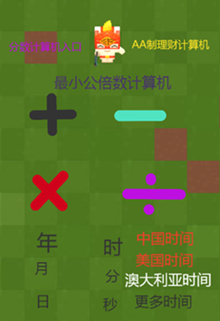

## [1.程序模块手册【连载中】](https://www.codemao.cn/wiki/novel/cover/1361)

* 由桔汁糖浆原创的小说，里面分享了一些常用的编程算法，如自然的跳跃、摇杆效果、双按键判定……

* 点击图片打开传送门：

> 贡献者：桔汁糖浆（15岁）

## 2.编程小课堂

* 通过编程作品的形式简单解释了函数、物理、变量、链表等积木盒概念。
* 点击图片打开传送门：

> 贡献者：主播喵副本（11岁）

## 3.《超级计算机》（内含《如何让电脑记住玩家输入的名字》教程）

* 在编程猫中，计算机的原理很简单，主要是运算模块和数据模块的应用。小帅训练师也用此原理做了自己的代表作：《超级计算机》。

* 点击图片打开传送门：

> 贡献者：小帅（12岁）

## 4.如何画几何图形
* 教大家如何使用动作积木和画笔积木，绘制出各种各样的几何图形。

* 点击图片打开传送门：

> 贡献者：小帅（12岁）

## 5.制作角色加速减速效果
* 应用变量来实现角色的加速减速效果。
* 应用场景：比如制作跑酷游戏，需要角色吃到道具，就减速或者加速。
* 点击图片打开传送门：

)

> 贡献者：小帅（12岁）

## 6.贺卡制作BUFF
* 简单的一些小技巧就可以做出酷炫的效果！
* 点击图片打开传送门：

> 贡献者：技术喵

## 7.开头特效

- 一个好的作品当然也需要一个吸引人的开头，来看看小帅训练师分享的简单开头特效制作！
- 点击图片打开传送门：

)

> 贡献者：小帅（12岁）

