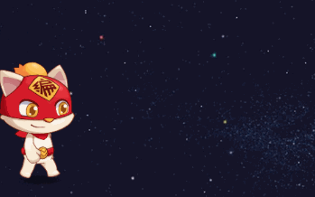
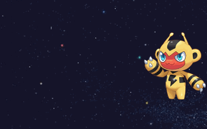
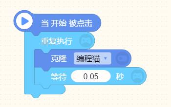
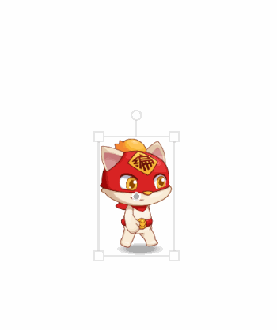
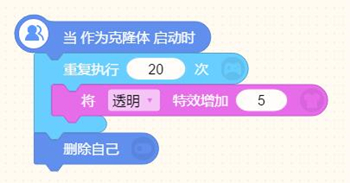

# 【克隆与分裂】
分裂、克隆，两个如此相像的功能，到底有什么不同呢？我们来了解一下！
## 1.什么是克隆？

* 克隆是指在游戏中复制一个空代码角色，克隆的是当角色被克隆那一刻的状态，不同时刻克隆出来的是不同状态的克隆体。
* 不同时刻克隆出来的“克隆体”，它们定格的动作和方向都是不同的。（如图所示）

      加上颜色可以更清晰的看见，每个“克隆体”克隆的都是“本体”不同时刻的外观颜色。↓

* 涉及到克隆的脚本位于【事件】积木盒子中：

* 由于克隆体不会克隆本体的脚本积木，如果想要让克隆体运行，就需要用到 **[当作为克隆体启动时]** 积木，
  积木下方所连接的脚本就是克隆体的脚本， 并且是所有克隆体都运行这些脚本，克隆体也可以继续克隆角色。

* #### 温馨提示：克隆体最多只能克隆300个，多余的会被自动删除哦，保证游戏运行的流畅度。

## 2.什么是分裂？

* 分裂的角色除了复制外形之外，还会继承原角色的积木，将选中角色的所有代码复制一遍，并将分裂体分裂到设定的坐标位置。
  也就是说，本体做什么，分裂体就做什么。

* **注意：** 在使用“当开始被点击”作为条件时，分裂模块不要随便使用在角色自己上！**因为所有的分裂体都会不断执行分裂模块，形成可怕的指数型增长，增长爆炸会导致页面直接奔溃。 **大家可以在**背景中分裂其他的角色**.
  ​

## 3.克隆与分裂的区别
* 克隆与分裂最大的区别就是，一个不会继承脚本积木，一个会继承本体所有的脚本积木。
* 如果你想要让复制出来的角色能运行与本体一样的脚本，那使用“分裂”是最方便的；反之，如果你想要复制的角色与本体执行不一样的脚本，那么选择“克隆”会更方便一点。

* **举个例子：**

一个抖动的编程猫 分裂 一次后 变成两只抖动的编程猫 （分裂体和本体完全一样）

一个抖动的编程猫 克隆 一次后（不设置当克隆产生的脚本）产生只有外形没有脚本的编程猫

前者分裂很难控制和区分谁是本体谁是分裂体，后者克隆有比较明显的先后主次顺序。

* **技术喵提示：** 不管是分裂还是克隆，不再使用克隆体的时候，都应该使用“**删除自己**”及时把克隆体删除，以免造成游戏运行时性能上不必要的消耗。（目前超过300个克隆体的话系统也会自动删除多余克隆体。）

> 贡献者：假·猫老祖（9岁）& 无可否认（11岁）& Yue.S

## 4.如何用克隆制作“残影分身”效果
* 如图所示，编程猫移动时身后带着半透明的身影。

使用克隆积木，加个等待秒数，稍微间隔一点时间，那么编程猫移动时，身后就会出现克隆的编程猫身影。

但是这样克隆出来的编程猫不仅没有透明的效果，还会一直增加占满整个屏幕。

这么可怕的事情当然是不能出现的，我们要养成良好的克隆习惯，每次克隆，都要注意删除不必要的克隆体。
即使用 *[删除自己]* 这个积木， 这样角色每次克隆自己一次都会自觉删除克隆体一次。

至于透明的效果，就是使用【外观】模块里的透明特效就可以了。

