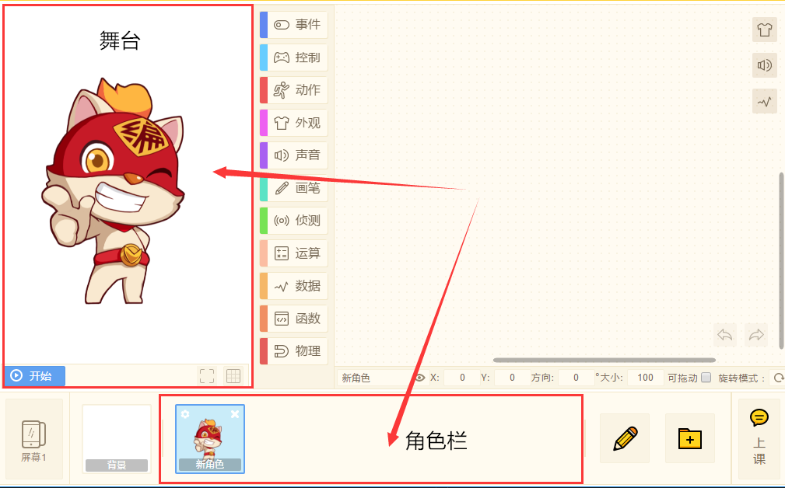

# 【快速添加素材】
一般我们都是通过素材库来添加各种素材，当所需素材缺少时，可以通过素材商城购买素材，来扩充素材库。

当素材商城也不能满足需求的时候，训练师们可以通过素材库的【本地上传】来添加素材。

上传的素材会在【我上传的】分类中。

除此之外，还可以快速添加素材！很简单！就是直接把素材拖入创作页面！
### 1. 如何快速添加背景
* 把你想要添加的背景图素材直接拖入“背景”区域，就可以成功添加背景，还可以批量添加哦！
  

* 技术喵演示：
  

### 2.如何快速添加角色
#### 2.1添加一般格式图片
* 将角色素材（一般是PNG格式），直接拖入到“角色栏”位置，或者拖入“舞台”位置，就可以成功添加角色。同样可批量添加。
  
* 技术喵演示：

  

#### 2.2添加动图
* 如果你想上传gif动态图片，直接将文件拖入到“舞台”，即可成功添加角色。
 gif图片内不同帧的图像将自动生成多造型，是不是很方便！（支持5M以下gif图）

- 技术喵演示：

  

## 

### 3.如何快速添加角色造型

* 与添加角色不同的是，添加角色造型需要打开“数据栏”内的“造型栏”，在对应角色的“造型栏”内添加角色的各个造型。
* 技术喵提示：只能上传bcm、bcmp、png、jpg、jpeg、bmp、svg格式的素材哦！ 

* 技术喵演示：
  

* 成功添加造型角色后我们就可以使用【外观】模块中的“造型”积木使角色变换造型。
  

