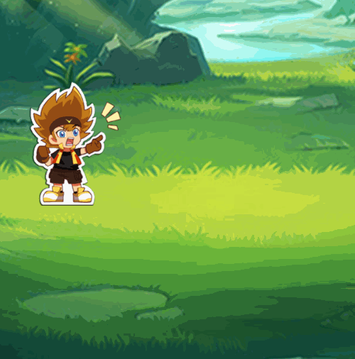
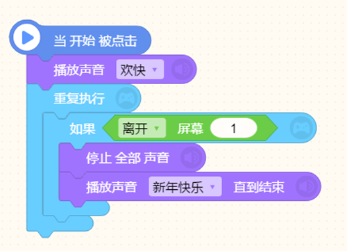

# 【屏幕】
* 在制作游戏中，屏幕应用于多场景切换，屏幕与屏幕间的背景和角色相互独立存在，可通过脚本积木进行屏幕切换，特别在制作RPG（角色扮演类）游戏时，分屏幕更可事半功倍。
* #### 如何添加屏幕：

（1）点击左下角 背景旁边的屏幕按钮

（2）展开，点击“+”号添加屏幕

* #### 如何切换屏幕
* 使用[切换屏幕背景]脚本积木可进行屏幕切换。

当开始被点击后，“阿短”说话，说完切换到屏幕[背景2]

当屏幕切换到[背景2]后，“编程猫”执行移动指令，移动到背景中间。

我们可以看到阿短和编程猫所在的屏幕背景不同，这就是屏幕的背景和角色各自独立存在。

* #### “成功”和“失败”
利用屏幕切换还可以将“成功”和“失败”分别设置在两个屏幕内，比如设置在屏幕3和屏幕4。

那么当你需要调用到“成功”或“失败”时，就可以切换到对应的屏幕3或屏幕4

* #### [离开/留在]屏幕
当你切换到另一个屏幕时，你希望更换音乐或者让音乐停止，那就需要借助[离开/留在屏幕]这个脚本积木，如果离开指定屏幕，就停止全部声音；如果是切换音乐的话，切换过程记得要加一个[停止全部声音]，先停止原来的再播放其他音乐，否则两首歌会重叠播放。

* RPG游戏推荐：

《你能活几章》（连载中）

运用屏幕多达55个，剧情丰富多样，拥有多种结局，玩法简单，音效到位，实属良心之作！

作者：国民帅逼（12岁）

