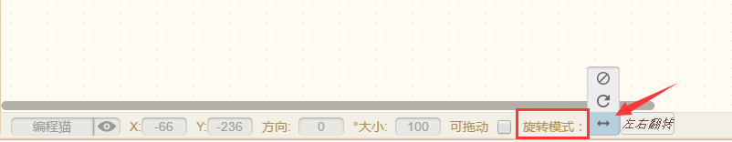
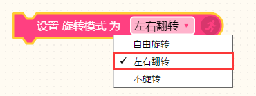

# 【旋转模式】

* #### 编程猫平台的旋转模式有三种：

1、自由旋转

角色按设定角度顺时针或逆时针旋转。

2、左右翻转

随着角色角度改变，角色只进行左右翻转。

3、禁止旋转（不旋转）

（嗯，就是不会动~）

在这种情况下，旋转积木无效，旋转多少度都没有用！

> 贡献者：技术喵

* #### **为什么角色碰到边缘反弹时会上下颠倒？**

在源码图鉴的\[动作类\]积木中，我们认识了\[碰到边缘就反弹\]这个脚本积木，那萌新训练师可能会遇到这样一个情况：角色碰到舞台边缘反弹时，出现了上下颠倒的情况。

这是由于系统默认的旋转模式为“自由旋转”，在这种情况下，角色自然会出现头朝下，脚朝上的尴尬场面。▼

* 想要缓解尴尬最好的方式就是把角色的旋转模式改为“左右翻转”，有两种方式：

第一种是直接修改\[角色属性栏\]的“旋转模式”。▼

第二种就是使用\[积木盒子\]里的“_设置旋转模式为\[自由旋转/左右翻转/不旋转 \] _”脚本积木。▼

* 改为“左右翻转”的旋转模式后：

> 贡献者：小帅（12岁）

