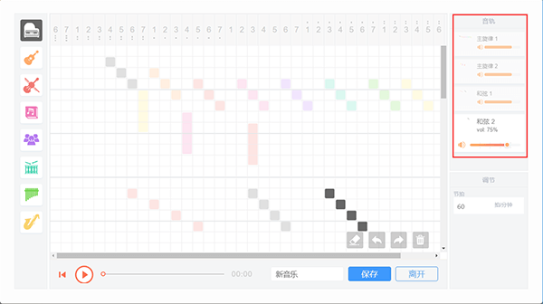

## 【快速制作原创配乐】

- 源码音乐画板是什么?

  音乐画板将像素绘画和音乐相结合，只要挥动画笔便能制作奇妙的音乐，轻松设计旋律和节拍，探索有趣的声音！音乐画板目前支持60s的音乐制作，点击保存音乐将自动保存到素材库。

- 源码音乐画板如何使用？

   打开“创作”页面，点击右下方“音符”图标就可以打开“音乐画板”。

- 左侧可以选择各种不同颜色的画笔（乐器），绘制完成后，音乐会从上至下，以画笔的轨迹进行播放。

- 右侧的音轨功能可以像画板的图层一样绘制多音轨的音乐，同一位置的音符会同时播放，使音乐效果更佳丰富。

- 【使用技巧】

  - 使用斜线表现音阶时的音色效果较好，因此画图时可以尝试45°斜画。

  

  - 使用不同音色不同声部演奏同一首乐曲。

  

  - 你还可以在网上搜集喜爱的乐曲和弦谱，然后据此模仿或改编。

  ​