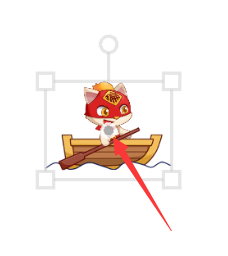
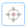
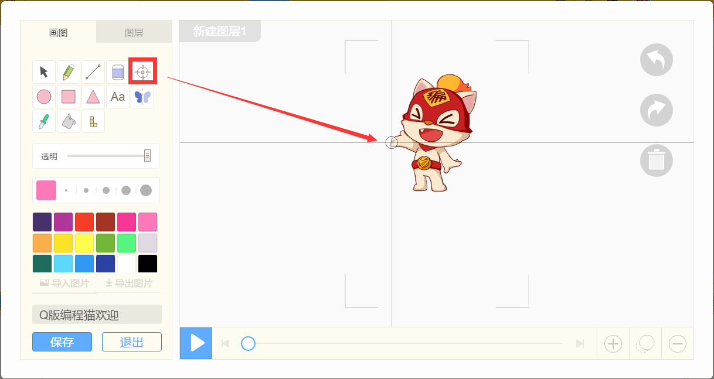
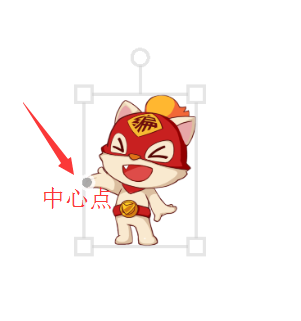
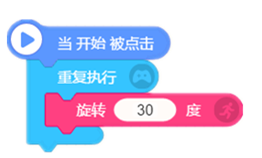
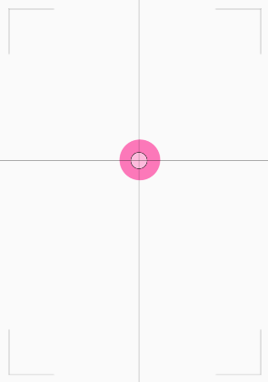
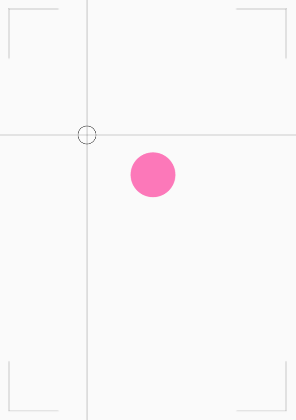
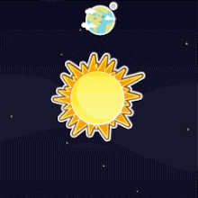

# 【中心点】

* #### 什么是中心点？

中心点一个可以自由设定的点，可以设置在角色各个位置，不同位置会出现不同效果。

角色可以围绕着这个中心进行旋转、缩放、对称等需要设定中心点的操作。

中心点的按钮图标：

在编程猫画板上，可以点击改变角色中心点位置▼  

* #### 中心点的作用

主要有两个：

##### 1、中心点的位置就是角色坐标的位置

如果调整角色的坐标，角色的中心点就会移动到这个坐标点上。

* #### [什么是坐标？](./bian-cheng-xiao-ji-qiao/坐标.md)

##### 2、“中心点”与旋转有关

中心点是角色旋转的中心位置，我们可以通过改变中心点的位置，来实现想要的旋转效果。

* ##### 举个例子：

在角色使用相同脚本积木的情况下，设置中心点在不同位置会表现出不同的效果。

当中心点设置在“角色中心位置”时，角色的旋转效果▼

当中心点设置在“角色外边位置”时，角色的旋转效果▼

PS：地球围绕太阳旋转时，地球的旋转中心就是太阳中心的点哦~

