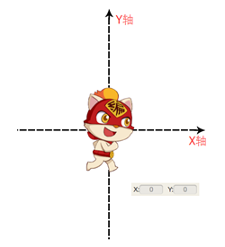
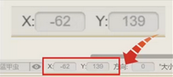
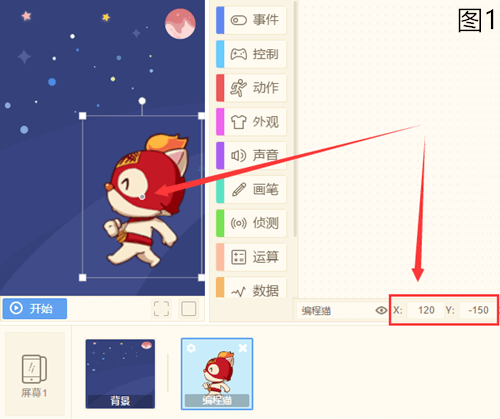
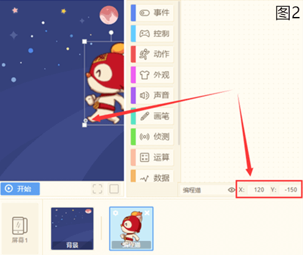
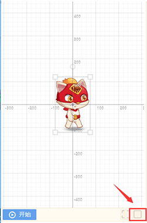
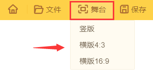

# 【坐标】
## 1.什么是坐标
* 坐标是角色在舞台上的位置，有对应的X和Y轴。坐标系可以定量地描述物体的位置，一个位置对应一个坐标，X的正负值代表左右，Y的正负值代表上下。
* 我们把空间里所有的点都编上序号，就能用坐标系表示空间里每一个点。

* 在创作页面的角色属性栏中，可以看到角色所在位置的坐标数据：

## 2.坐标点即中心点 
* 角色位置的坐标，就是角色中心点的所在位置
* **举个例子：** 
改变角色中心点，那么角色的位置也会发生改变。

图1和图2，编程猫的坐标点都为[X:120,Y:-150]，图1的中心点设置在编程猫脸上，而图2设置在脚尖。

很明显，同一个坐标，中心点不同，编程猫的位置也不同。

* #### [什么是中心点？](./bian-cheng-xiao-ji-qiao/zhong-xin-dian.md)

## 3.舞台坐标系
* 只需要轻松点击舞台右下方的“坐标系”图标（如图所示），就可以打开舞台的坐标系，清楚看到角色的坐标。

## 4.编程猫舞台大小
* 编程猫共有3种舞台大小，可以任意调节。

 

  竖版舞台大小：高900 X 宽620 
  
  横版4:3舞台大小：高720 X 宽960

  横版16:9舞台大小：高720 X 宽1280