# 动作类
## 1.移动（10）步

# 

* 相当于X坐标增加10，也可理解为角色向右移动10个长度单位。

* 最好理解的方式就是：这个角色向右走10步。

> 贡献者：小帅（12岁）

## 2.旋转（30）度

* 使角色旋转指定度数。
* 一般情况下，旋转分为顺时针旋转和逆时针旋转，数值为正数时，逆时针旋转；数值为负数时，顺时针旋转。
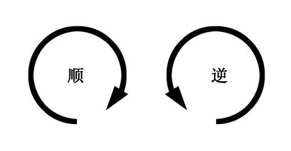

> 贡献者：技术喵

* #### [什么是中心点？](./bian-cheng-xiao-ji-qiao/zhong-xin-dian.md)
* #### [什么是旋转模式？](./bian-cheng-xiao-ji-qiao/xuan-zhuan-de-mi-mi.md)

## 3.抖动（1）秒

# 

* 角色进行抖动1秒，秒数可设置，延长或缩短抖动的时长。

* **应用场景：** 经常用来表示角色受到点击、攻击（如下图：雷电猴受到攻击）或神情兴奋。

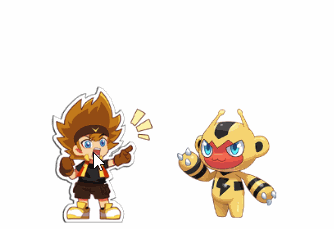

> 贡献者：小帅（12岁）

## 4.碰到边缘就反弹

* 当角色碰到舞台边缘时，会改变运动方向，朝反方向运动。

* **应用场景：** 通常与\[重复执行\]和\[移动10步\]结合使用，那么角色就会向前移动直到碰到边缘往回走，这样来回运动。

> 贡献者：小帅（12岁）

* #### [为什么角色碰到边缘反弹时会上下颠倒？](./bian-cheng-xiao-ji-qiao/xuan-zhuan-de-mi-mi.md)

## 5.面向（90）度

* 面向90度其实就是让角色面向90度方向，方向的度数可修改调整。

> 贡献者：小帅（12岁）

## 6.面向\[角色\]

* 角色面向指定的另一个角色，不同角度面向角色的方向都不同。

* 其实就是 [面向（90）度 ] 的plus版

* **举个例子：** 下图编程猫收到 [广播“Hi”]，集体面向 [滑稽教官]，三只编程猫面向滑稽教官的角度都不一样。

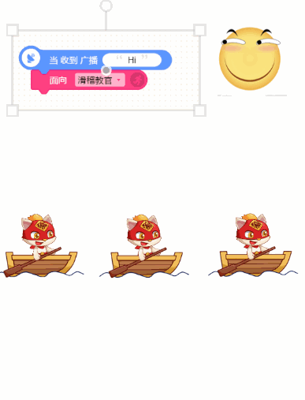

> 贡献者：小帅（12岁）

## 7.移到X：0， Y：0

* 强调结果：瞬间到达某一个坐标点，颇像科幻小说里的瞬移。

> 贡献者：小帅（12岁）

* #### [什么是坐标？](./bian-cheng-xiao-ji-qiao/坐标.md)

## 8.在（1）秒内，移到X：0，Y：0

* 强调过程，在指定时间内移动到某个坐标点。
* #### [移到x：0 ，y：0 ] 与 [在（1）秒内，移到移到x：0 ，y：0 \] 二者的区别▼

下图中，同样是移动到一个坐标点，上面的编程猫是瞬间到达指定位置，下面的编程猫则是在指定的时间内缓缓移动到指定位置。

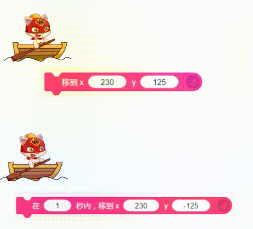

> 贡献者：小帅（12岁）

## 9.移到\[鼠标指针/随机/角色\]

* 使角色移动到某个指定位置，下拉框里可选移动到鼠标指针、随机一个位置或某个角色位置。

> 贡献者：D.A（10岁）

## 10.将X/Y坐标设置为（100）

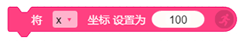

* X坐标决定角色在舞台的左右位置，设定角色的X坐标，不影响Y坐标

* Y坐标决定角色在舞台的上下位置，设定角色的Y坐标，不影响X坐标

> 贡献者：D.A（10岁）

## 11.将X/Y坐标增加（100）

* 在X坐标原来的数值基础上，增加指定数值，角色\[左右移动\]到原数值+增加数值的总数值位置。

* 在Y坐标原来的数值基础上，增加指定数值，角色\[上下移动\]到原数值+增加数值的总数值位置。

> 贡献者：D.A（10岁）

## 12.在（1）秒内，X坐标增加（200）

* 强调过程：改变X坐标时，角色在指定时间内一点点地移动
* 改变X坐标时，Y坐标不变，左右移动，上下不动。
* 改变Y坐标时，X坐标不变，上下移动，左右不动。

> 贡献者：小帅（12岁）

## 13.设置此角色\[可/不可拖动\]

# 

* 设置此积木，选择“可拖动”或“不可拖动”，会决定角色在游戏运行中是否可以被鼠标拖动到任一位置。

> 贡献者：小帅（12岁）
* **技术喵补充:** 设置角色是否可拖动，还可以直接从角色属性栏修改。

 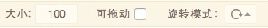

## 14.设置旋转模式为\[自由旋转/左右翻转/不旋转\]

# 

* 可以在游戏运行中改变角色的旋转模式。值得注意的是，旋转模式并不影响角色的实际角度。

* 自由旋转：根据角色实际的面向方向，向相应的角度旋转。
  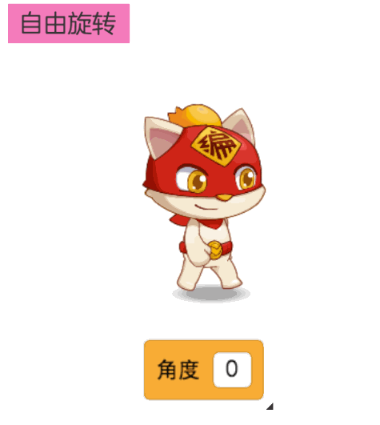

* 左右翻转：角色只进行左右翻转，只有两种翻转方式。

  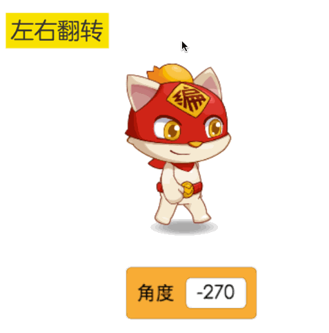                                      

* 不旋转：角色不会根据角度进行旋转。
  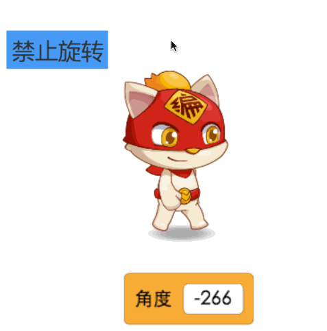
  ​

* #### [更多的旋转技巧](./bian-cheng-xiao-ji-qiao/xuan-zhuan-de-mi-mi.md)

> 贡献者：技术喵

## 15.围绕[编程猫]旋转（30）度
# 
* 设置此积木，让角色A围绕指定另一个角色B旋转指定的度数。
*    我们可以借助这个积木，轻松实现星体围绕的效果。
    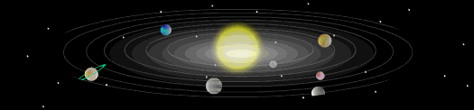 
    
 * **举个例子：**    地球围绕太阳旋转
 
 在地球这个角色上添加[重复执行]积木，围绕太阳角色进行旋转，就可以达到下图的围绕旋转效果。
# 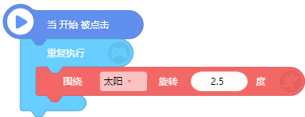

# 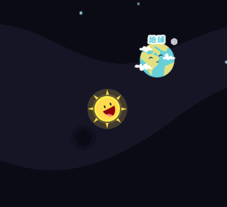

## 16.设置角色阵营为[红色阵营]
# 
* 将角色设置为指定颜色阵营。
* 与侦测类积木中的“碰到”积木结合使用。

将不同角色设置为相同颜色阵营，即可操纵同一颜色阵营的角色行动
* #### 举个例子：

我们设置“编程猫”、“阿短”、“雷电猴”为【红色阵营】，设置“木叶龙”、“火球球”为【黄色阵营】。

当同为红色阵营的3个角色，碰到黄色阵营中任意一个角色就会停止行动。

# 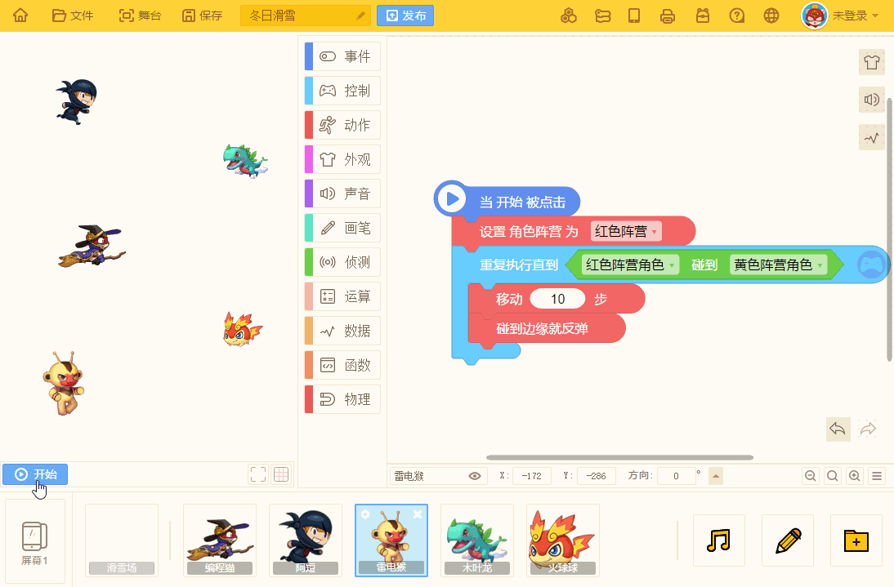

