# 分类AI
## 一、分类AI基础知识介绍
### 1、什么是分类器
分类器是数据挖掘中对样本进行分类的方法的统称。

为了让大家对分类有个直观的认识，我们先来看两个例子：
* 酒类识别：我们测量了一瓶酒的颜色(波长)、酒精浓度，机器根据这些判断这瓶酒是属于啤酒、红酒、白酒中的哪一种。
  
* 疾病判断：病人到医院去做了一大堆肝功、血液测验，把测验数据送进一个机器里，机器根据这些数据来判断这个病人是否得病，得的什么病。

 这种对输入的东西能够进行自动分类的机器，就叫做分类器。

   对我们人类来说，单凭肉眼可能也能对酒类进行一个简单识别，但是对疾病判断就没那么容易了，这个时候，如果有个疾病判断的分类器，那我们只要输入相应的检测数据，就可以得出判断结果。

  而基于人工智能的分类器不仅仅能做到疾病判断这种程度的事情，更复杂，更多特征值的判断它也能做，因为对电脑来说，存储和计算都是它最擅长的东西。有了这么一个强大的分类器帮手，在未来，几乎所有复杂的判断都可以让人工智能辅助我们做判断，更好的利用人工智能，你就能在未来获得先机。
    实现分类器有很多方法，基于神经网络的深度学习就是其中一种！
### 2、分类AI原理（神经网络）
   神经网络模型起源于尝试让机器模仿大脑的算法，将模仿神经元的脑神经单位进行连接，形成网络状图。

   如图所示：

   完整的神经网络包括输入层（4个输入单元）、隐藏层（2层，分别是4个和3个隐藏单元）、输出层(2个输出单元）。

   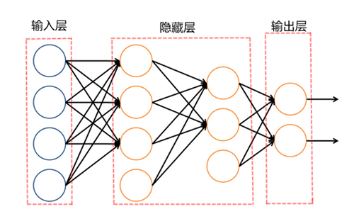

* 1）输入层：输入需要预测事物的特征值。

    比如：
        酒类识别中，酒的特征值就是酒的颜色、酒精浓度；

        疾病判断中，疾病的特征值就变成了一大堆的化验数据。

* 2）隐藏层：隐藏层可以是单层的，也可以是多层的，每一层里都有一定数量的神经元。
         通过复杂的隐藏层结构，提取输入数据中的显著特征，将结果传到输出层。

* 3）输出层：拥有不同输出分类结果的这一层被称为输出层。

   比如：酒类识别中，输出的结果是啤酒、红酒、白酒；

        疾病判断中，输出的结果是健康、感冒、发烧等。
   简单来说，整个神经网络通过输入层收集信息，利用隐藏层进行运算和处理信息，再从输出层输出分类结果，这样就做到了分类器的功能。

### 3、神经网络的训练与预测
分类器需要通过训练来大概地预测出分类结果。

####  举例说明：
  一个从来没见过酒的人和一个对酒很有研究的人，哪个更能分辨出酒的种类呢？

* 答案肯定是后者，一个喝过很多酒，对酒很有研究的人，非常了解酒的种类和味道，喝酒的次数越多，知道的酒的品种也就越多。
* 同样的，对于分类器来说，它也需要大量的训练数据不断进行训练，并且每一组的训练数据需要包含所有的特征值以及分类类别。
* 就好像训练一个不懂酒的人，训练的次数多了，他也能分辨出酒的种类。而预测结果是否准确，与神经网络的结构、训练次数、甚至训练时的一些随机发生的因素都有关系。

## 二、分类AI的积木用法
### 1、矩阵数据积木

* 可用来直接调取矩阵的指定行或列的数据。
* 矩阵数据分为两种：

     - 1、用户可自行上传相关数据的excel表格，系统会存作矩阵数据，即二维数组。

    - 2、为了方便用户学习使用积木，系统预制了4组训练数据：上下分布、左右分布、圆形分布和螺旋分布，并分别存为矩阵数据。

    

### 2、设置训练特征和分类数据

* 设置训练数据的特征，必须是数字类型，如果是非数字类型，会被系统自动忽略。

* 设置训练数据分类：既可以是数字也可以是字符串形式，系统会自动识别总共的类别数量。
  （目前输出层只支持2种类别，否则无法运行。）

* 举例说明：

如图一个典型的训练数据结构，在这个矩阵中，每一行为一组数据。
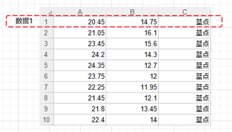

红框圈住的，是众多训练数据的其中1组：数据1。

A1的值20.45与B1的值14.75，就是数据1的两个特征值。

C1的类别蓝点，就是数据1输出的分类结果。

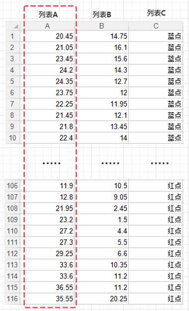

而整个矩阵，就是由所有组的训练数据特征值及分类组成的。

其中列表A与列表B为训练数据的特征，列表C行为该特征下的分类结果：蓝点和红点。

* 训练数据积木的两种标准用法：

  - （1）列表形式

     在数据侧边栏中新建列表：

     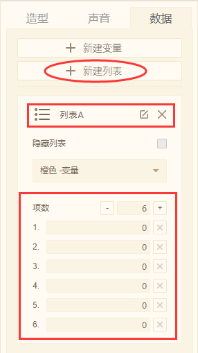

    输入相应数据即可直接调用列表数据：
      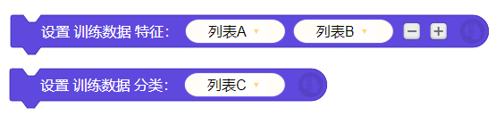

  - （2）矩阵形式

    上传本地的excel表格或系统预制的4组数据都会存作矩阵
     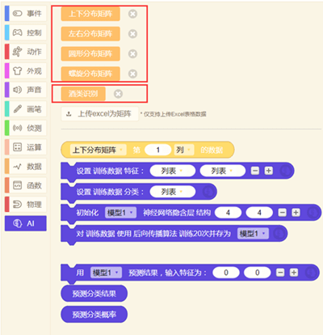

     使用矩阵数据积木即可直接调用

    
### 3、神经网络结构（隐含层结构积木）
 
 * 设置神经网络隐藏层的结构。
   - 隐藏层可以是单层或多层，不同的神经网络隐藏层结构，对最后的训练结果会产生不同的影响

    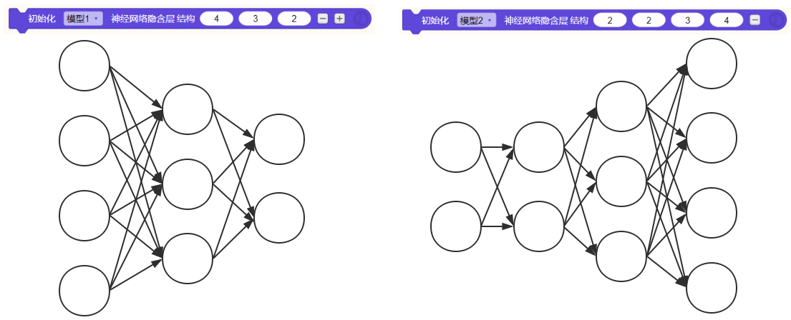

### 4、后向传播算法（训练积木）
 
 * 对设置好的训练数据使用特定算法进行训练，并存为模型
   - 单个积木训练次数为20，若需多次训练需要使用重复循环积木。
- 在训练时，舞台中也会出现该模型的相关训练信息。
   - 当输入层也就是训练特征为2时，会出现模型预测的训练图像。

   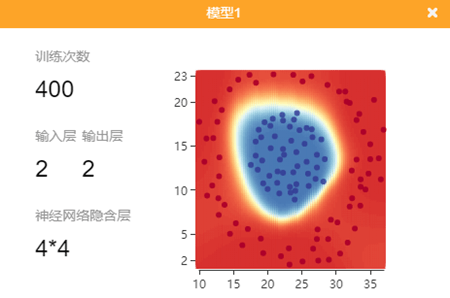

   - 当输入层为非2时，无法显示预测的图像

   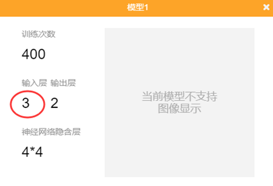

   - 随着训练次数的增多，预测的模型也会更加准确：

   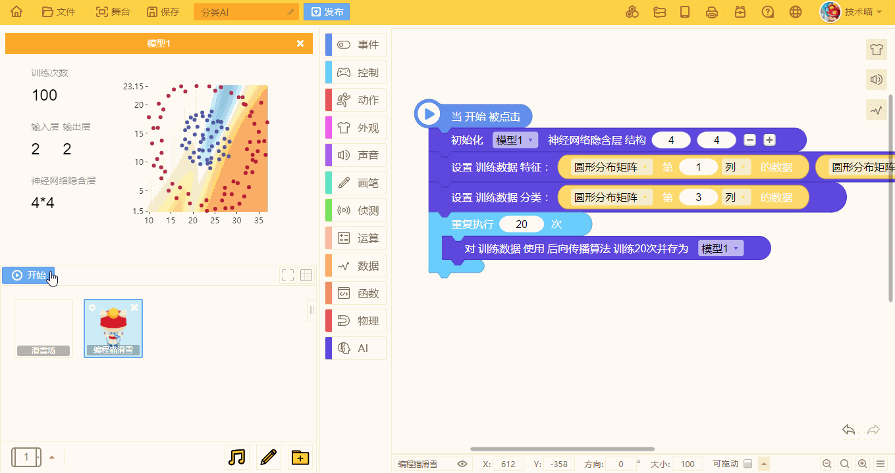

   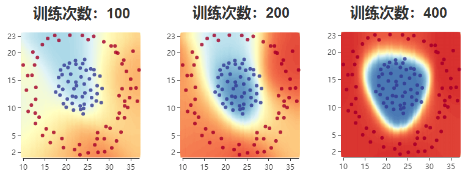

### 5、预测积木

* 将训练完的训练数据存作模型，对新的输入特征进行分类预测。
  - 注意：预测的特征值数量与原训练数据的特征值数量需一致，否则无法预测结果。
* 预测出的结果分为两种形式：
  - （1）预测分类结果

     
    ​            
     作用：直接显示预测的分类结果，输出形式为变量。

      

     表现形式：
      

   - （2）预测分类概率

      

     作用：显示该组特征值中，不同分类结果的概率，输出形式为列表。

      

     表现形式：

     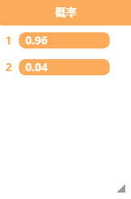 