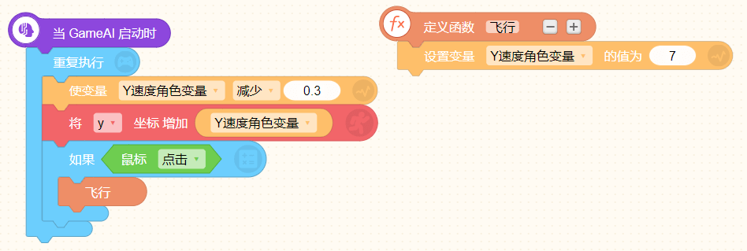
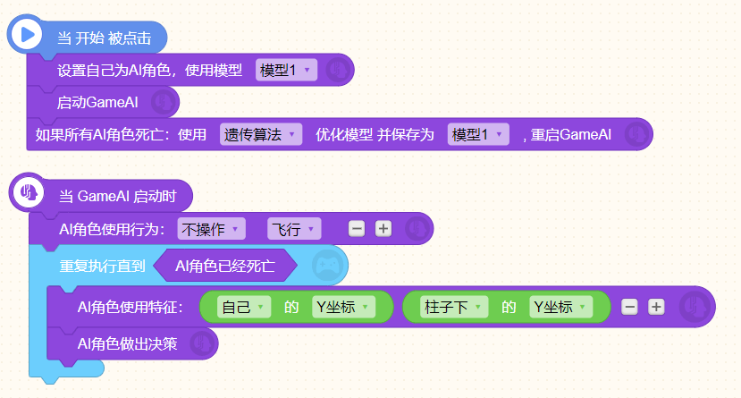

# GameAI
## 神经网络-GameAI   

​	人工智能的发展是全方位的，除了应用于分类AI外，还能应用于游戏领域，利用人工智能的相关算法来进行自动化AI。
​	传说中第一个战胜围棋世界冠军的人工智能程序AlphaGo（阿法狗），它的主要工作原理，就是利用神经网络的深度学习算法进行学习。
​	那么AI是如何利用神经网络结构来工作的呢？

## GameAI原理
 GameAI的工作原理与分类AI相同，都是在神经网络的基础上进行。

 如图：一个完整的神经网络包括了输入层、隐藏层、输出层。▼


​     
```
* 输入层：负责收集信息，就是游戏中实时变化的数据；
  比如自己角色的坐标、自己的血量、敌人的坐标、敌人的数量等等。
  
* 隐藏层:将收集的信息导入后进行运算和处理；

* 输出层：输出分类结果，就相当于我们玩游戏时做出的决策。
  比如控制角色移动，控制角色跳跃，控制角色发射子弹等等。
```

那么为了让GameAI能够正确做出决策，我们也需要对整个神经网络结构进行训练，以此得到我们需要的模型。在GameAI的训练上，我们有多种不同的方式。

以FlappyBird这款游戏做示例，介绍如何通过GameAI让人工智能自己玩Flappy Bird。


先来看看《FlappyBird》的代码：


​    
    “小鸟”角色设置一个全局变量：Y速度
    这个速度不断减少的同时，小鸟的Y坐标也会根据Y速度的值而变化，从而模仿了小鸟由于受重力影响不断下落的过程。
    当鼠标点击时，我们设此时小鸟的Y速度为正值。此时小鸟会向上跳跃一段距离，并继续往下落。碰到任意一个柱子时，结束游戏。


    游戏开始后，不断减少“柱子下”角色的X坐标，来模拟柱子始终右移的效果。
    当“柱子下”移出左边屏幕（X < -370）后，再将他移动到屏幕右侧。
    当“柱子下”移动到中间位置（X = -100）时，此时正好对应小鸟通过柱子，所以变量分数增加1。


​    

```
然后设置“柱子上”角色不断移到“柱子下”这个角色的位置，不断将Y坐标增加1100。
```

​    以上就是这个游戏主要角色的脚本积木。了解了这个游戏的脚本积木后，我们选择小鸟为AI角色，让小鸟进行学习。


​    在GameAI里，我们支持两种学习模式：有监督学习模式与无监督学习模式。

## 【有监督学习模式】


### 1、初始化模型
选择小鸟为AI角色，初始化一个模型：模型1

其中输入层和输出层的数据我们先空着，隐含层可以自己调整，对于Flappybird这个游戏，我们推荐设为单层4个神经元。


### 2、确定输入输出信息 
1）确定输入层的信息： 

我们选择的两个特征是：“小鸟”和“柱子下”角色的Y坐标值。 


##### （注意将中心点设置在如图所示的位置：小鸟中间以及柱子下的顶部中心，）


2）确定输出层的信息： 

我们自己玩这个游戏时，会有两种操作：什么都不做 和 点击鼠标。 

对应到GameAI，就是两个输出结果：1、不操作，2、使小鸟飞行。 

由于机制上的设定，要想调用到AI角色的使用行为，我们必须先用函数积木，将鼠标点击触发的飞行事件封装起来。


然后设置AI角色的使用行为积木调用：


3）角色死亡条件

设置AI角色的死亡条件：

然后设置实时读取的AI角色特征值：
与分类器不同的是，GameAI中的输入特征值是实时变化的。


4）完善输入输出数量 

确认了输入输出信息后，还要记得在初始化模型的位置填入输入层和输出层的数量，完成整个模型的设定。 


    输入层输入的特征是“小鸟的Y坐标”和“柱子下”的Y坐标，所以是2个； 
    输出层输出的是“不操作”和“飞行”，所以也是2个。

### 3、训练并记录数据
设置好模型及输入输出信息后，就要开始训练GameAI： 


在有监督学习模式下，我们需要先自己玩游戏，将游戏中的操作记录下来，作为训练数据，不断地训练及记录，训练得差不多之后，就可以停止训练并保存在模型1中，用这个训练数据进行学习，这就是有监督学习。


### 4、后向传播算法
当AI角色死亡时，我们可以使用“后向传播算法”继续优化所选用的模型。

根据记录的训练数据优化后，模型将会模仿训练数据中的行为继续行动。


 训练完毕后，如果想保留之前的训练结果，记得移开初始化模型积木再运行。


### 5、使用模型
当模型训练好后，我们就可以使用该模型，让AI角色自己做决策，自动进行游戏啦！


 将“AI角色做出决策”积木放在AI角色特征积木下方。

 这样，AI能够基于当前的特征值做出使用行为的决策，即“不操作”或“飞行”。

 实现AI角色的自动游戏


* ####  有监督学习模式下的Flappybird
    点击图片即可跳转到作品页面，建议购买代码，实际操作一下哦~

  [](https://ide.codemao.cn/we/1349923)


## 【无监督学习模式】
 有监督学习模式，就相当于我们手把手教AI如何玩游戏，使用的是后向传播算法。

 那么无监督学习模式，就是让AI自己学会玩游戏，使用的是遗传算法。

GameAI的无监督模式下，初始模型是随机生成，而不是训练来的。

通过生成大量的随机模型，让AI角色在游戏中不断尝试，这些模型有的会很快淘汰掉，有的却可以得很高的分。 

然后通过遗传算法，将得分高的模型结构保留下来，像生物一样让他们相互之间进化，
最终训练出能够获得更高分，表现地更好，一代比一代强的模型。

同样用《FlappyBird》这个游戏来举例说明无监督学习模式：

### 1、初始化模型
无监督与有监督一样，选择小鸟为AI角色，初始化一个模型：模型1

先设置隐含层结构为单层4个神经元：


对于无监督来说，如果每次只运行一个角色，那效率就太低了。

因此我们需要设置多个角色数量，这里设置每轮运行数量100：


### 2、角色变量、事件启动   
为了让这100只小鸟独立运行，我们需要改变一些游戏设置：角色变量和事件启动积木。 

1）设置角色变量   
 对于这个游戏来说，需要修改小鸟的全局变量Y速度，改为角色变量。

 

 修改脚本积木中涉及到的变量：
  

2）修改触发事件积木

因为克隆出100只小鸟需要一定的时间，为了避免部分先克隆出来的小鸟比其他小鸟先行动，我们需要把游戏开始时的触发事件改为“当GameAI启动”使所有小鸟同步行动。

  

### 3、确定输入输出信息
1）确定输入层的信息

选择两个特征：1、小鸟的Y坐标值，2、柱子下的Y坐标值。
 

 2）确定输出层的信息
我们自己玩这个游戏时，会有两种操作结果：什么都不做，和点击鼠标

那么对应到GameAI，就会是两个输出结果：1、不操作，2、使小鸟飞行。

我们需要先把游戏本身鼠标点击触发的事件（飞行），用函数封装起来。


然后才能选择AI角色使用行为：不操作和飞行。


3）角色死亡条件

设置AI角色的死亡条件：

然后设置实时读取的AI角色特征值：
与分类器不同的是，GameAI中的输入特征值是实时变化的。


4）完善输入输出数量 

 确认了输入输出信息后，还要记得在初始化模型的位置填入输入层和输出层的数量，完成整个模型的设定。 
 

### 4、GameAI决策
让AI自己做决定：不操作还是飞行。


### 5、遗传算法
当AI角色死亡时，记录AI角色的得分，等到所有AI角色都死亡，就能从中找出这一批里更好的模型。


当所有的AI角色都死亡后，使用“遗传算法”优化模型，并重启GameAI进行下一次预测。


训练完毕后，如果想保留之前的训练结果，记得移开初始化模型积木哦，这样程序才会在之前模型1的基础上继续优化模型！


6、使用模型
模型训练完毕，我们可以使用模型，让AI角色自动游戏啦！ 
使用模型，启动GameAI。


* ####  无监督学习模式下的Flappybird
    点击图片即可跳转到作品页面，建议购买代码，实际操作一下哦~

  [](https://ide.codemao.cn/we/1331737)


## 【使用模型扩展AI游戏】

如果对模型满意的话，我们还可以用AI模型制作AI游戏。

无论我们用监督学习模式，还是无监督学习模式，最终保存的模型都会存在BCM文件里。

那么，我们就可以直接让小鸟基于模型1自动游戏：


值得注意的是，AI角色的行为、使用的特征，都需要与训练时保持一致。

然后我们就可以扩展这个游戏：

1、我们可以让玩家跟AI角色PK

 ##### (点击gif图可打开游戏页面哦~)
[](https://lab.codemao.cn/work/1350484)

2、控制水管，给AI角色制造难度哦~
​    
 ##### (点击gif图可打开游戏页面哦~)
[](https://ide.codemao.cn/we/1350423)


