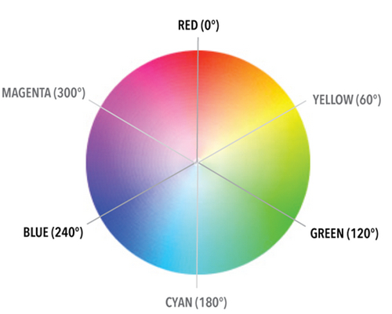
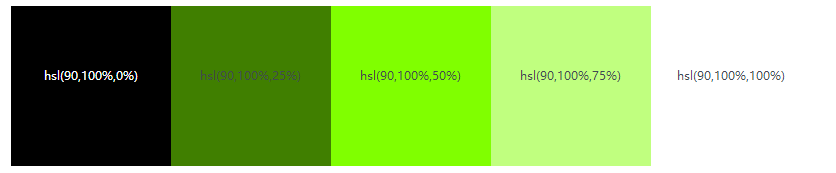
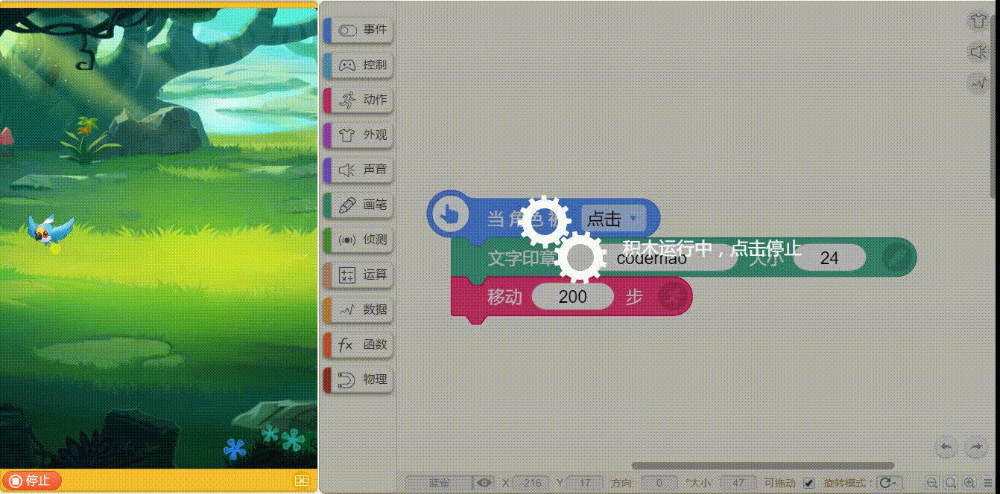

# 画笔类
## 1.落笔

* 当某个条件执行时，就像将笔放到纸上画画一样，可以在舞台上画画。

* 这个积木是全部画笔积木的基本积木。如果没有这个积木，是画不出痕迹的。

> 贡献者：糖醋排骨（10岁）& 小帅（12岁）

## 2.抬笔

* 当某个条件执行的时候，画笔不再画出痕迹，就跟把画笔抬起来一样，停止作画。

> 贡献者：糖醋排骨（10岁）& 小帅（12岁）

## 3.清除画笔

* 清除画笔，瞬间清除全部画的痕迹。

> 贡献者：小帅（12岁）

## 4.设置画笔粗细（5）

* 设置画笔粗细，这个值是可以调整的，用来设置你的画笔粗细。
* 系统默认的画笔粗细是1。

> 贡献者：小帅（12岁）

## 5.设置画笔颜色值[色块]

* 给画笔设置一种颜色，点击色块不仅可以选色还可以取色

> 贡献者：小帅（12岁）

## 6.使画笔粗细增加（5） 

* 增加画笔粗细，这个值也同样是可以调整的，可以增加或减少画笔的字迹大小，就是画笔粗细

> 贡献者：小帅（12岁）

## 7.使画笔颜色值增加5

* 根据HSL颜色模式系统对颜色进行色度划分，此积木的作用就是通过改变数值来改变画笔的颜色。

* #### HSL指的是色调(H)、饱和度(S)、亮度(L)，其中颜色模式就是指下图颜色色盘中多少度的颜色值。颜色值的设定也是以360为一个循环，颜色值增加360便会回到本来的颜色。

> 贡献者：技术喵

## 8.使画笔亮度增加5

* 可以增加画笔落笔时的痕迹亮度 正值颜色越来越浅，负值越来越深

* 亮度是指颜色偏向于白色调还是黑色调。

减少亮度会增加黑色调：当亮度为0%时颜色变为黑色。

增加亮度会增加白色调：当亮度值为100%时颜色变为白色。

> 贡献者：技术喵

## 9.文字印章“Hello”大小（24）

* 文字印章，就是可以复制出文字框的内容。大小也是可以设置的，正值越来越大，负值越来越小。不需要_\[落笔\]脚本积木也可以使用哦。_

> 贡献者：小帅（12岁）

* **技术喵提示**：小心积木和你玩捉迷藏，挡在角色后面了~

* **应用场景：**

通常可以与“动作类积木”相结合，比如与“移动200步”积木结合，设置当角色被点击时，落笔，复制相应文本框的内容后，角色移动200步。

