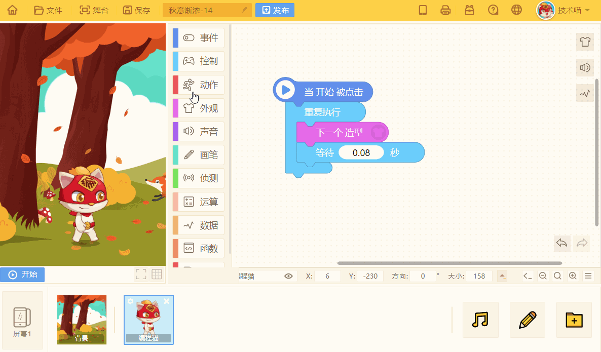
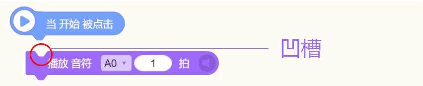
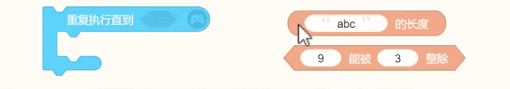
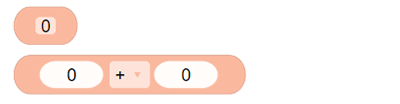
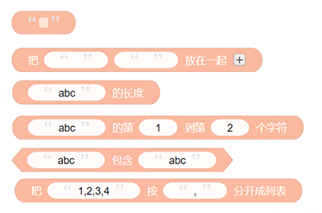
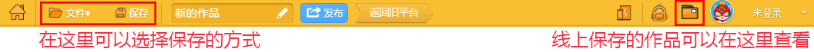
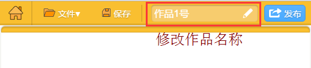
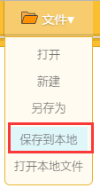
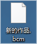
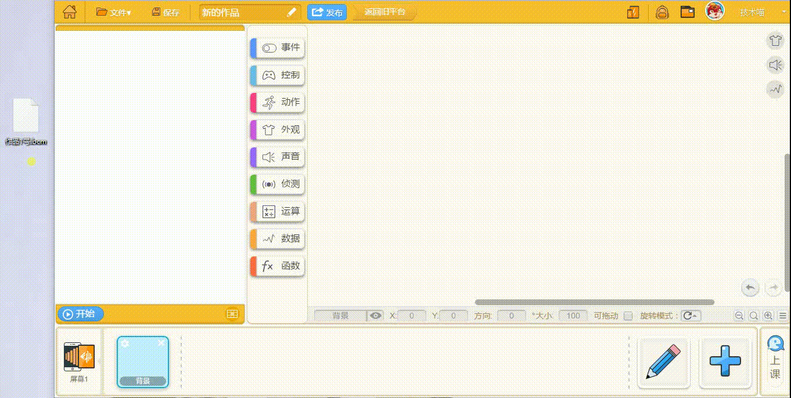

# 科普小知识

### 1.什么是编程猫IDE？

编程猫ide是一个能够展示训练师想象力的平台，功能多样的脚本积木是创作的基础。只要拖出你想要的功能积木，在右边区域内按照你的思路拼接组合起来，点击开始按钮，就可以在左边舞台看到你创作的作品。

### 2.积木类型

* #### **事件开始类型**

左边带小图标的积木代表事件的开端，是其他类型脚本积木得以在游戏中运行的关键。

当这类积木被触发后才会运行下面的脚本积木，就好像是火车头，起到带动整车车厢运行的作用。

* #### **普通函数类型**

普通函数类型的积木就好像拼图，有凹也有凸，可上下连接积木。

其中有些积木里面还带有类椭圆形参数或六边形判断接口的，可拖入相同形状类型的积木对准之后进行拼接。

* **技术喵提醒：形状不同的积木可是没有办法拼接成功的哦！**

* #### **条件类型**

如果&lt;条件&gt;满足，执行“如果”框中拼接的积木，不满足则运行“否则”框内拼接的积木。

* #### **循环类型**

重复执行其包含的脚本积木（20）次

* #### 带返回值的类型

**（1）数值类型**

返回整数或者小数，边缘是圆形的

**（2）布尔类型**

返回“成立”或者“不成立”，布尔类型积木的边缘是尖的

**（3）字符串类型**

返回字符串，字符串类型积木的内部带有双引号

**（4）变量／列表类型**

变量类型的积木可以表示 数值，字符串，位置等任何类型。

在编程猫的编程语言中，列表类型其实等价于数组类型，其中的元素可以是任意类型，如：\['abc', 2, false\]

### 3.保存机制

##### （1）线上保存

* 保存：修改作品名称后，点击“保存”即可保存你的作品。

* 另存为：在保留原作品的基础上，生成一份一模一样的作品副本，在副本上进行独立操作。

* 自动保存机制：对于正在编辑的作品，每隔5分钟自动保存（网络正常的情况下）。

##### （2）保存到本地

* 点击“保存到本地”即可将你的作品保存为一份bcm格式的文件。

* 在文件处选择“打开本地文件”或直接把bcm文件拖入舞台即可打开作品。

* **技术喵提醒：** 由于safari浏览器的限制，safari浏览器是不能把作品保存到本地的...

