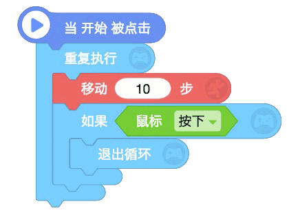
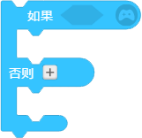
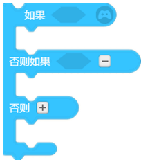
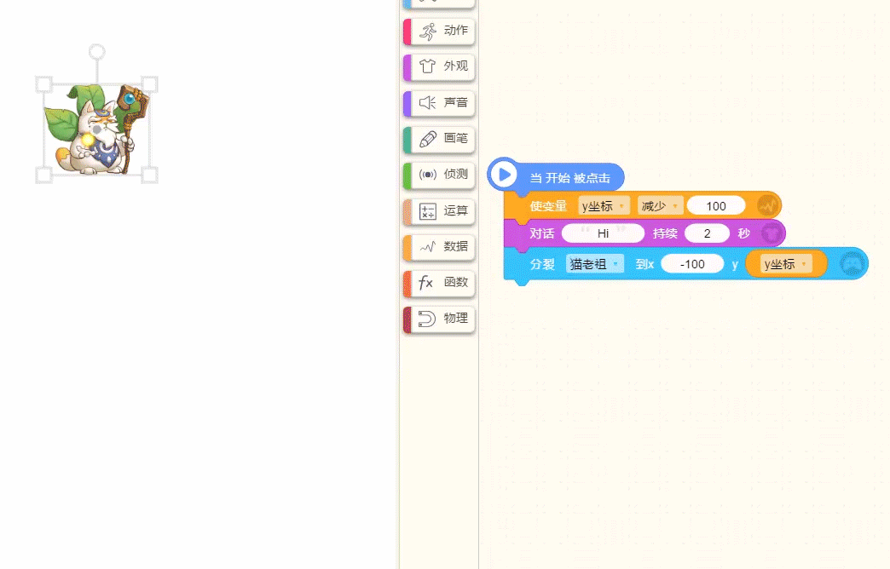

# 控制类
## 1.重复执行

* 重复执行无限次积木框内包含的脚本积木，直到触发“退出循环”时才会运行此积木下方的脚本。

> 贡献者：技术喵

## 2.重复执行[ 20 ]次

* 重复执行输入数值次的此积木框内的脚本，执行完后运行此积木下的脚本。

> 贡献者：假·猫老祖（9岁）

## 3.重复执行直到&lt;条件&gt;

* 重复执行框内的脚本直到满足嵌入处的条件后，运行此积木下的脚本。

> 贡献者：假·猫老祖（9岁）

## 4.退出循环

* 退出最近一个重复执行，执行下面的脚本。

> 贡献者：假·猫老祖（9岁）

## 5.告诉\[某角色\]执行

* 告诉 *[选中的角色]* 执行此积木框内的脚本，相当于简化广播。

  技术喵补充：“告诉[某角色]执行”也可以快速完成广播的效果，但是只适用于角色，不适用于背景。

> 贡献者：假·猫老祖（9岁）

## 6.告诉\[某角色\]执行并等待

* 告诉 [选中的角色] 执行框内的脚本，执行完毕后再执行下面的脚本

* #### “告诉-执行”与“告诉-执行并等待”的区别：

   “告诉-执行”是没有先后顺序的，而“告诉-执行并等待”是必须等框内的脚本执行完毕才执行下一个脚本。

   如图：
   
   设置雷电猴和编程猫的脚本为：重复执行切换下一个造型指定次数，以及重复执行移动指定步数。
   
   告诉雷电猴执行，告诉编程猫执行并等待
   
   可以看到雷电猴是边切换造型边移动，而编程猫是等待造型切换指定次数后才移动。
   

## 7.如果&lt;条件&gt;

* 如果嵌入处的&lt;条件&gt;成立，则执行“如果”积木框内的脚本，否则跳过此积木块。

> 贡献者：假·猫老祖（9岁）

## 8.如果&lt;条件&gt;否则

* 如果第一个嵌入处的&lt;条件&gt;成立，则运行“如果”框中的脚本，不成立则运行“否则”框内的脚本。

* 点击“+”可在其中再增加一个“如果&lt;条件&gt;否则”：

* 如果第一个嵌入处的&lt;条件&gt;成立，则运行“如果”框中的脚本，如果第二个嵌入处的&lt;条件&gt;成立，则运行“否则如果”框中的脚本，不成立则运行“否则”框内的脚本。

> 贡献者：假·猫老祖（9岁）

## 9.等待[ 1 ]秒

* 用于隔开积木，等待"输入的数值"秒后，执行下面的脚本。

> 贡献者：假·猫老祖（9岁）

## 10.保持等待直到&lt;条件&gt;

* 用于隔开积木

  在嵌入处的&lt;条件&gt;成立之前，一直等待，直到嵌入处的条件成立后，运行下面的脚本。

> 贡献者：假·猫老祖（9岁）

## 11.分裂\[ ？\] 到 x\[300\] y\[200\]

* 分裂指定的角色到指定坐标位置，分裂出来的角色（分裂体）与被分裂的角色一模一样（包括脚本积木）。

* 分裂体会继承本体的积木，也就是说，本体做什么，分裂体就做什么。

* **举个例子：** 下图是猫老祖分裂出猫老祖（分裂体）。

* 所以，假如本体含有 _“分裂\[？\] 到x\[300\]y\[200\]”_ 这积木，分裂体也会有，于是就会一直分裂下去——直到崩溃为止。但是，假如是另一个角色B分裂角色A呢？那么就只会分裂一次，因为A没有 _“分裂\[？\] 到x\[300\]y\[200\]”_ 这积木。

> 贡献者：假·猫老祖（9岁）& 无可否认（11岁）

* [分裂和克隆的区别](./bian-cheng-xiao-ji-qiao/ke-long-yu-fen-lie.md)

