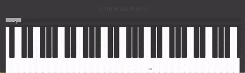

# 声音类

## 1.播放声音\[ ？\]

* 播放 你选择的声音 的那一刻同时执行下面的脚本

> 贡献者：假·猫老祖（9岁）

## 2.播放声音\[ ？\]直到结束

* 播放 你选择的声音 直到此声音全部播放完毕则开始执行下面的脚本

> 贡献者：假·猫老祖（9岁）

* 技术喵提醒：要重复播放背景音乐，不能直接把播放声音放到重复执行里面，这样会造成很多声音同时播放的鬼畜现象，应该使用**播放声音直到结束**模块哦。

## 3.播放音符A0（1）拍

* 播放你选择的钢琴音 你输入的数值 拍

> 贡献者：假·猫老祖（9岁）

- 技术喵提示：点击音符下拉箭头会出现钢琴键盘，拖动上方控制条可横向移动钢琴键盘，按琴键即可直接选音。

  另外，训练师们也可以使用音乐画板，直接绘制你想要的音乐~

  
* #### [制作原创音乐](./bian-cheng-xiao-ji-qiao/yuan-chuang-yin-yue.md)

## 4.等待（1）拍

* 等待“你输入的数值”拍

注：等待1拍 ≠ 等待1秒

> 贡献者：假·猫老祖（9岁）

## 5.停止全部声音

* 停止目前游戏所运行的全部声音

> 贡献者：假·猫老祖（9岁）

## 6.说“你好”

* 说 “你输入的文本”的同时执行下面的脚本，支持中文和英文。

> 贡献者：假·猫老祖（9岁）

## 7.说“你好”直到结束

* 说“你输入的文本”直到说完才执行下面的脚本，支持中文和英文。

> 贡献者：假·猫老祖（9岁）
* **技术喵提示：** 要注意上面6和7二者的区别，一个是同时，一个是先后。

## 8.识别语音\[中文/英文\]

* 需要电脑安装录音设备。
* 使用后会进行语音识别，可识别中文/英文，搭配 *[识别结果]* 积木使用。（微信扫一扫不支持识别英文）

> 贡献者：假·猫老祖（9岁）

## 9.询问“你的名字是？”并识别\[中文/英文\]

* 需要电脑安装录音设备
* 询问 你输入的文本 并语音识别中文/英文，搭配 *[识别结果]*]积木使用（微信扫一扫不支持识别英文）

> 贡献者：假·猫老祖（9岁）

## 10.识别结果

* 识别语音录入的结果

> 贡献者：假·猫老祖（9岁）

## 11.询问“你的名字是？”并录音

* 需要电脑安装录音设备
* 询问 “你输入的文本”并录音

> 贡献者：假·猫老祖（9岁）

## 12.播放录音

* 播放最近一次的录音内容

> 贡献者：假·猫老祖（9岁）

