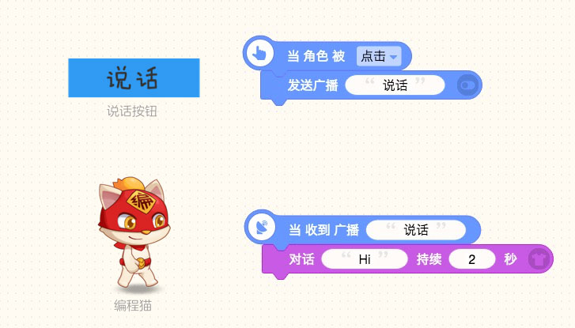
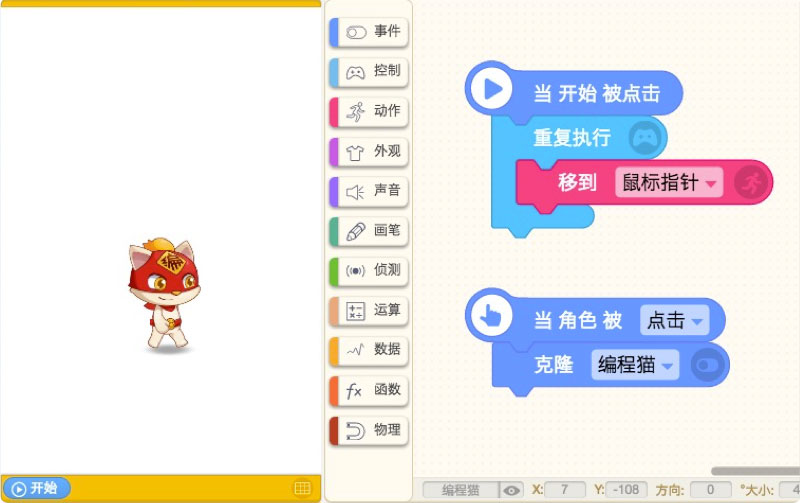
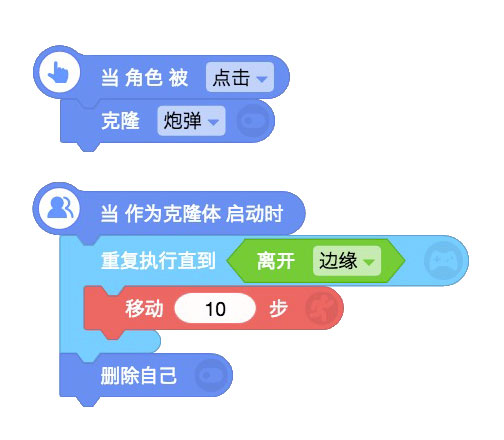

# 事件类

## 1.当开始被点击

* 事件的开端：当开始按键被点击时，立刻执行这块积木下的脚本积木。

> 贡献者：假·猫老祖（9岁）

## 2.当角色被\[点击\]

* 事件的开端：当该角色被 /点击/按下/放开 时，立刻执行这块积木下的脚本积木。

> 贡献者：假·猫老祖（9岁）

## 3.当在手机上向\[上\]滑动

* 事件的开端：技术喵为手机端使用倾心制作的积木，当在手机上向 上/下/左/右 滑动时，立刻执行这块积木下的脚本积木。

> 贡献者：假·猫老祖（9岁）

* **技术喵补充**：点击右上角的“扫一扫”，通过手机微信扫码可以查看或分享你的作品。

## 4.当\[按下\]\[a\]

* 事件的开端：在键盘上【按下/放开】你选中的键时，立刻执行这块积木下的脚本积木。

| 状态   | 按下、放开                   |
| :--- | :------------------------------ |
| 键盘   | 26个英文字母，0-9数字，上下左右键，空格键，回车键，任意键 |

> 贡献者：假·猫老祖（9岁）

* **技术喵补充**：如果一直按住则会不断触发\[按下\]条件

## 5.停止\[全部脚本\]

* 停止\[全部脚本\]：停止整个作品的脚本。

* 停止\[当前脚本\]：停止该积木所在的那组脚本。

* 停止\[当前角色的其他脚本\]：停止除了当前角色外，该积木所在组的脚本积木以外的其他脚本。

* 停止\[其他角色的脚本\]：停止该角色以外的其他全部脚本。

> 贡献者：假·猫老祖（9岁）

## 6.停止

* 停止运行整个游戏。

> 贡献者：假·猫老祖（9岁）

## 7.重启

* 将全部脚本、角色归回原位、回到初始状态，从头开始执行脚本。

> 贡献者：假·猫老祖（9岁）

* **应用场景**：

“重启”模块，经常在闯关失败或者游戏结束时使用，给予玩家重新开始的机会。

## 8.发送广播\[Hi\]

* 给所有的角色（包括背景）发送一个广播，通知收到该广播内容的角色开始执行某些操作。

* 配合“_当收到广播\[Hi\]_”使用，圆形输入框中输入该条广播的名称，以区分其他的广播。

> 贡献者：假·猫老祖（9岁）

## 9.当收到广播\[Hi\]

* 事件的开端：接收到这个广播的角色马上执行它下接的积木。

* 配合“_发送广播\[Hi\]_”使用。

> 贡献者：假·猫老祖（9岁）

* **技术喵补充**：
  广播经常在不同的角色之间使用，传递信息，形成一系列的事件。“告诉【某人】执行...”也可以快速完成广播的效果，但是"告诉\[某人\]执行"只适用于角色，不适用于背景。

* ### [**动画小教程——广播**](https://ide.codemao.cn/we/92803)

### 

> 贡献者：尚冲（11岁）

## 10.切换屏幕\[背景\]

* 编程猫的舞台可创建多个屏幕，屏幕之间相互独立，使用“切换屏幕”可快速切换场景，可以修改屏幕名称。

> 贡献者：艾莉克莎（12岁）

* **应用场景**：

技术喵倾心打造的屏幕功能，特别适合做RPG游戏的场景切换、游戏封面、关卡页面、成功或失败页面。

* #### [屏幕的妙用](./bian-cheng-xiao-ji-qiao/ping-mu-de-miao-yong.md)

# 11.切换屏幕（1）

* 快速切换到对应数字的屏幕。

> 贡献者：艾莉克莎（12岁）

* **技术喵提醒**：删除其中任何一个屏幕，屏幕的顺序会自动补位，要注意可能造成的变化。

# 12.当屏幕切换到\[背景\]

* 事件的开端：当切换到相应的屏幕时，执行以下的积木脚本。

> 贡献者：艾莉克莎（12岁）

* **技术喵提醒**：

当游戏存在多个屏幕时，尤其要注意多使用该积木。

* **举个例子：**

如果在 _\[屏幕3\] _使用触发条件“当开始被点击时”，而不是“当屏幕切换到_\[屏幕3\]_”，那么只要点击开始，即使没有切换到_\[屏幕3\]，\[屏幕3\]_上的脚本也会开始运行，这样会造成性能上极大的消耗，以及发生不确定的bug，训练师们要避免这样的编程习惯。

# 13.克隆[ ？]

克隆指在游戏中复制出一个“空代码角色”（克隆体）在角色上，克隆的是当角色被克隆那一刻的状态，不同时刻克隆出来的是不同状态的克隆体。（包括大小、角度、坐标、质量、形状、造型等，唯独没有任何脚本积木）。

> 贡献者：假·猫老祖（9岁）

技术喵补充：自己试试在创作页面上添加以下脚本积木，移动鼠标，点击编程猫看看效果：

# 14.当作为克隆体启动时

* 事件的开端：当克隆体生成后，克隆体立刻执行此积木下的脚本。

前面我们说了，克隆体是个“空代码角色”，那它的代码怎么做呢？这个时候就要用_\[当作为克隆体启动时\]_这个积木，当出现克隆体时，克隆体就会执行这个积木块下方连接的脚本。

* 克隆体可以继续克隆角色。最多克隆300个，系统会自动清除300个以上的克隆体，保证运行速度。

有些人会问：“怎么让克隆体收到广播？” 我告诉你：目前没有办法。那肿么办？用分裂！

> 贡献者：假·猫老祖（9岁）

* #### [克隆和分裂有什么区别](./bian-cheng-xiao-ji-qiao/ke-long-yu-fen-lie.md)

  ​

# 15.删除自己

# 

* 在游戏运行中将整个角色自身删除，包括它的造型和积木。

* 常用于克隆体。

> 贡献者：假·猫老祖（9岁）

技术喵补充：删除自己可以和克隆、分裂搭配使用，也可单独使用，删除角色本体。  **在大量使用克隆体的情况，克隆体用完后一定要及时删除自己！**

* **应用场景：**

飞机大战发射炮弹时，克隆的炮弹射出屏幕范围后，就要及时删除自己，否则将造成性能上极大的消耗，游戏会变得越来越卡顿。

