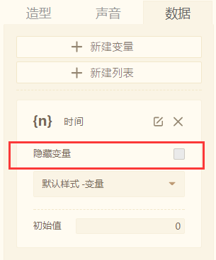

# 数据类
## 1.变量

* 猫老祖有三盒糖果，编程猫每天都会吃掉几颗。所以糖果剩下的颗数和吃掉的颗数都是在不断变化的！我们把它叫做：变量

* 变量是一个会变化的数值，而变量积木可用来调取某个设定好的变量数值。

默认样式：

可选样式：

* 举个例子：我们创建一个“时间”变量，变量积木就可以调取“时间”变量的数值。

  

> 贡献者：假·猫老祖（9岁）& 小帅（12岁）

## 2.设置变量\[ ？\]的值为（0）

* 设置一个变量为多少，即你输入的数值

> 贡献者：假·猫老祖（9岁）& 小帅（12岁）

## 3.使变量\[ ？\]的值增加/减少（1）

* 可以让一个变量在原来的数值基础上，增加或减少你输入的数值

* **举个例子：** 计数

我们设定一个变量为“按的次数”，设定当角色被点击时，这个“按的次数”变量增加1

可以看到点击时，变量数的增加▼

如果设置变量减少，按得次数也会依次变少。

还可以结合“随机”，“重复执行”脚本积木，用来决定游戏里的不稳定数值，如：速度、坐标等等。

> 贡献者：假·猫老祖（9岁）& 小帅（12岁）

## 4.显示/隐藏变量\[ ？\]

* 为了舞台的整洁，你可以在游戏运行时使某个变量【显示/隐藏】在某个时间或某个场景。

* 值得说明的一点是：一开始变量的隐藏或显示是可以调节的。▼

  

> 贡献者：假·猫老祖（9岁）& 小帅（12岁）

## 5.列表

* 列表是一个存放着许多个变量的容器，你可以存储或者获得容器中每一个变量的值。它就像一个有许多抽屉的柜子一样，每一个抽屉里面存放着物品。

  

* **如何新建列表**

  

* 在积木盒子里可以使用列表相关的脚本积木，给柜子添加或删减抽屉、替换抽屉里的内容等。

  

> 贡献者：主播喵副本（11岁）

## 6.添加（0）到（列表）末尾

* 添加你输入的数值到选择“列表” 的最后一项。

> 贡献者：假·猫老祖（9岁）

* 技术喵补充：大部分编程语言中，列表的项数一般都是从0开始；在编程猫，为了让训练师更容易理解，所有的排序都是从1开始的，训练师们要注意哦~

## 7.插入（0）到（列表）的第（1）项

* 将你输入的数值插入到选择“列表” 的第一个位置。

> 贡献者：假·猫老祖（9岁）

## 8.删除（列表）第（1）项/最后一项

* 将你选择的“列表” 第（你输入的数值 ）项的文本/数值从列表中删除。

> 贡献者：假·猫老祖（9岁）

## 9.替换（列表）第（1）项/最后一项为（0）

* 将“列表”的第（你输入的数值 ）项重新设置（改变）成你输入的数值。

> 贡献者：假·猫老祖（9岁）

## 10.复制（列表）到（列表）

* 复制 选择的“列表” 的全部数据/文本 ，粘贴到第二个 选择的“列表”。

> 贡献者：假·猫老祖（9岁）

## 11.（列表）第（1）项/最后一项

* 用于调出 选择的“列表” 第（你输入的数值 ）项的数值或文本

> 贡献者：假·猫老祖（9岁）

## 12.（列表）的长度

* 用于调出“列表“的长度

\* 列表的长度表示：列表的项目数

> 贡献者：假·猫老祖（9岁）

## 13.（列表）中是否包括（0）

* 属于布尔值类型积木

* “列表”全项中是否含有（你输入的数值 ） 数值或文本。

> 贡献者：假·猫老祖（9岁）

## 14.显示/隐藏\[列表\]

* 在游戏运行时使 “列表“ 显示或隐藏。

> 贡献者：假·猫老祖（9岁）

## 15.（0）在（列表）中的位置

* 调取某项内容在整个列表中的位置。
* 如果调取内容不在整个列表中，则返回数值“0”。
* **举个例子：**

图1调取的是数值“2”在列表“编程猫”中的位置，返回数值“2”，即在第2位。

图2调取“绿豆”在列表“编程猫”中的位置，由于列表“天”中只有数值“1”和“2”，没有“绿豆”，所以返回数值“0”

> 贡献者：技术喵