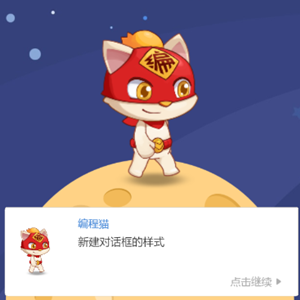
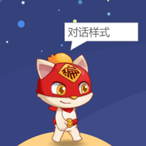
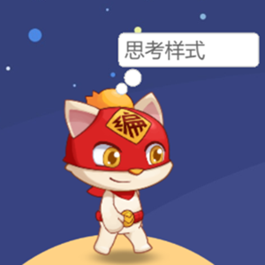
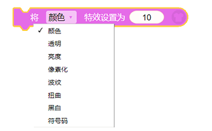

# 外观类

## 1、切换到造型\[造型名称\]

* 使角色的造型切换到 角色的某个造型

> 贡献者：无可否认（11岁）&假·猫老祖（9岁）

## 2、切换到变化为（1）的造型

* 使角色的造型切换到第 ？个编号对应的造型。

> 贡献者：无可否认（11岁）&假·猫老祖（9岁）

## 3、下一个造型

将角色的造型切换到下一个造型

> 贡献者：假·猫老祖（9岁）

## 4、显示

* 将角色在程序运行中显示，使玩家可以看见该角色。

> 贡献者：无可否认（11岁）&假·猫老祖（9岁）

## 5、隐藏

* 将角色在程序运行中隐藏，使玩家无法看到该角色。

> 贡献者：无可否认（11岁）&假·猫老祖（9岁）

## 6、在（1）秒内逐渐显示

* 该角色在？秒内渐渐浮现，使玩家可以看到该角色。（缓慢执行）（浮现式）

> 贡献者：无可否认（11岁）&假·猫老祖（9岁）

## 7、在（1）秒内逐渐隐藏

* 该角色在？秒内渐渐消失，使玩家无法看到该角色。（缓慢执行）（消失式）

> 贡献者：无可否认（11岁）&假·猫老祖（9岁）

## 8、新建对话框“HI”

* 在程序中新建一个对话框，对话框的内容为 你输入的文本  ，直到鼠标点击对话框表示玩家已阅完此文本，则开始执行后续的脚本。（样式如下）

> 贡献者：假·猫老祖（9岁）&无可否认（11岁）

## 9、对话/思考（Hi）

* 对话以方形对话框样式持续显示 “你输入的文本” 。
* 思考以圆角矩形对话框样式持续显示“你输入的文本” 。

样式如下：

  

## 10、对话/思考“HI”持续（2）秒

* 对话以方形对话框样式显示 “你输入的文本” 并持续显示设定的秒数后消失。
* 思考以圆角矩形对话框样式显示“你输入的文本” 并持续显示设定的秒数后消失。

> 贡献者：假·猫老祖（9岁）&无可否认（11岁）

## 11、询问“你的名字是？”并等待

* 新建方形对话框询问 “你输入的文本内容”， 并保持等待直到得到回复 ，然后继续执行后续的脚本

> 贡献者：假·猫老祖（9岁）&无可否认（11岁）

## 12、获得答复

* 调出最近一个询问获得的答复。

> 贡献者：假·猫老祖（9岁）

## 13、询问并选择

* 新建对话框询问“你输入的文本内容”，并保持等待直到选择一个选项后 继续执行后续的脚本

> 贡献者：假·猫老祖（9岁）&无可否认（11岁）

* **技术喵提示:**
  利用询问并选择模块，可以快速制作多选题，巧妙利用“-”减号和“+”加号可以增加或减少一个选项。(最多4个，最少1个)

## 14、获得选择

- 可以调出最近一个询问获得的选项。

> 贡献者：假·猫老祖（9岁）

## 15、获得选择项数

* 可以调出最近一个询问获得选项的项数，如第一个选项则为1。
> 贡献者：技术喵

## 16、把“你好！”翻译成\[各种语言\]

* 将 你输入的文本  翻译成 英文/中文/文言文/法语/西班牙语/日语 出现在对话框中。

> 贡献者：假·猫老祖（9岁）

## 17、“你好！”的\[各种语言\]翻译

* 调出以 你输入的 翻译成 英文/中文/文言文/法语/西班牙语/日语 的文本内容。

> 贡献者：假·猫老祖（9岁）

## 18、将角色的大小设置为（100）%

* 直接将角色的大小设置为 你输入的数值（%）

> 贡献者：假·猫老祖（9岁）

## 19、将角色的大小增加（10）

* 在角色的原大小（%）基础上 增加 你输入的数值（%）

> 贡献者：假·猫老祖（9岁）

## 20、 将角色的宽度/高度设置为（100）%

* 单独设置角色的宽度或高度。

> 贡献者：技术喵

## 21、 将角色的宽度/高度增加（10）%

- 单独改变角色宽度或高度，角色将以中心点作为轴心发生拉伸或收缩变化。 

> 贡献者：技术喵

* #### [如何制作进度条](./bian-cheng-xiao-ji-qiao/jin-du-tiao.md)

## 22、将[颜色]特效设置为（10）

* 将角色的[颜色/透明/亮度/像素化/波纹/扭曲/黑白/符号码]特效设置为“你输入的数值”程度。

> 贡献者：假·猫老祖（9岁）

**技术喵补充：**

* **颜色特效**：颜色特效使用HSL模式，以360为一个循环对色相进行更改。就像一个圆环一样，0为角色本来的颜色，增加颜色值角色颜色改变，当颜色值到360时，又回归到角色本身的色相，以此循环。

* **透明特效**：取值范围为0~100：0为不变化，100为完全透明，数值大于100按100处理，数值小于0按0处理。

* **亮度特效**：当亮度特效为0时，角色变为纯黑；亮度特效增加，角色会以RGBA矩阵原理逐渐变亮，直到角色变为全白。

  巧妙使用外观特效模块，可以轻松做出诸如闪烁、烟花、贺卡等炫酷效果，大家不必明白特效本身的原理，只要实际中尝试运用，很快就能理解积木的用途啦~

## 23、将[颜色]特效增加（10）

* 将角色的[颜色/透明/亮度/像素化/波纹/扭曲/黑白/符号码]特效增加“你输入的数值”程度

> 贡献者：假·猫老祖（9岁）

* **技术喵提示：** 萌新很容易搞错“设置”和“增加”，放错积木，所以一定要细心。

## 24、清除图形特效

* 清除角色的全部特效

> 贡献者：假·猫老祖（9岁）

## 25、移至最上层

* 将角色的图层设置为最顶层

> 贡献者：假·猫老祖（9岁）

## 26、将图层上移（1）

* 将角色的图层上移“你输入的数值”层数

> 贡献者：假·猫老祖（9岁）

## 27、左右/上下翻转

* 使角色整体 左右/上下 翻转

> 贡献者：假·猫老祖（9岁）

* 【外观】盒子的**左右/上下翻转**和【动作】盒子的**旋转模式**，二者的**左右翻转**模式有什么不同呢？

左右/上下翻转：在角色本身并没有改变角度的情况下，就可以完成角色的左右或者上下翻转。

设置旋转模式为[左右翻转]：当角色本身的角度改变时，角色随着角度改变而左右翻转。

