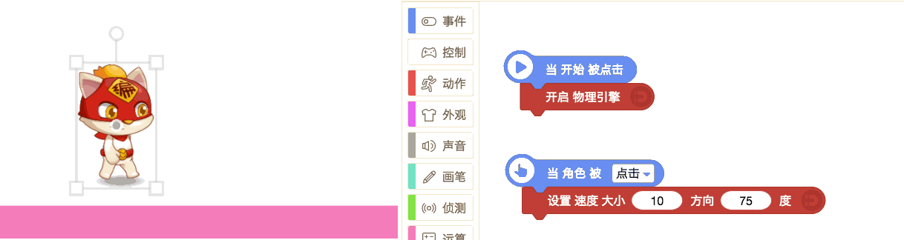

# 物理类
## 1.开启 物理引擎

* 假如要用物理积木，要先开启物理引擎（**在开启物理引擎之前，任何物理积木都没用！**）

* 当开启了物理引擎，这个角色则有了：重力、质量、摩擦力等。如同在舞台里加了个地心引力，开启了的重力的角色如果正下方没有任何角色，则会一直掉下去，如果有，则会被下面的角色接住。

> 贡献者：假·猫老祖（9岁）

* **应用场景：** 巧妙使用物理引擎可以快速做出超级玛丽、彩虹桥等游戏。

## 2.关闭 物理引擎

* 关闭了物理引擎角色会瞬间失去质量，不受任何力的作用，不再出现自由落体等物理效果。

> 贡献者：主播喵副本（11岁）

## 3.设置 引力加速度 大小\[10\] 方向\[-90\]度

* 改变地心引力加速度

* 大小：默认值为10。引力加速度越大，自由落体的速度越快。

* 方向：默认值为-90。引力方向为-90度时，开启物理引擎后角色会朝正下方坠落。

> 贡献者：假·猫老祖（9岁）

## 4.设置 速度 大小\[5\] 方向\[0\]度

* 设置角色的某个时间点的瞬移速度，方向和大小可以改变。

> 贡献者：假·猫老祖（9岁）

* **技术喵补充**：使用物理引擎时，要做出角色**跳跃的效果**，可以试试使用这个模块，设置一个合适的速度大小，方向在45度到75度间都是不错的选择哦~
  

## 5.设置 力的 大小\[5\] 方向\[0\]度

* 设置角色某个时间点的受力情况。

> 贡献者：假·猫老祖（9岁）

* **技术喵补充**：设置“力“和设置”速度“，虽然效果很相似，但是他们的物理意义是不同的，力更多的是改变物体这一瞬间的加速度，力产生的效果还和物体的质量相关。编程猫的物理引擎参考真实的物理原理，大家调整不同的数值可以对物理这门学科有更直观的了解哦。

## 6.设置质量\[10\]

* 角色的**默认质量由角色的大小决定**，角色越大，默认质量越大，当然也可以使用“设置质量”设定角色的质量为特定值；

* 角色质量增加会导致重力增加，反弹效果减小，倾倒效果增加。大家可以自己试试哦~

> 贡献者：鲸（10岁）

## 7.设置摩擦系数\[0.5\]

* **摩擦系数越大，角色本身受外力作用越大，角色受到的阻力越大**。
* **技术喵补充：** 摩擦系数范围为0-1，可取小数。

> 贡献者：鲸鲸（10岁）

## 8.设置反弹效果

* “设置反弹效果”积木可以轻松制作出弹力球碰撞反弹的效果，反弹系数取值的有效范围是0-1。

* 同一反弹系数，角色的实际反弹效果受角色形状和质量的影响，同一形状的角色，**质量越小，反弹得越明显**。

可以改变下面积木中的数字看看效果！

> 贡献者：技术喵

## 9.\[允许\]倾倒

* 允许倾倒后，物体在往下掉的过程中，会有倾倒效果，倾倒效果跟下落的速度、角色的质量、角色的形状有关。一般**质量越大，倾倒效果越明显**。

* **技术喵补充：** 有了倾倒效果，大家就可以做愤怒的小鸟了哦~

> 贡献者：技术喵

