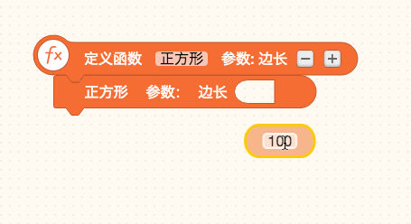
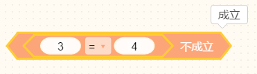
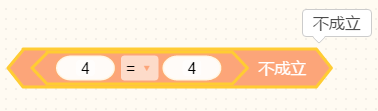
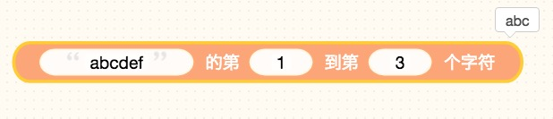
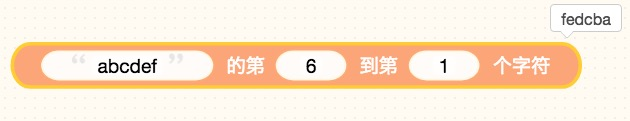
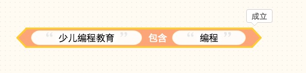
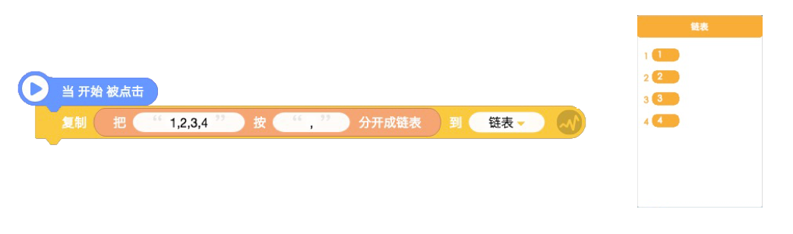
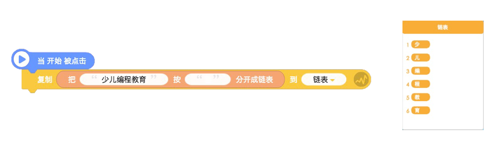

# 运算类
## 1.数值

* 输入整数或者小数，返回数值类型，可以拖入圆形白框或者半圆形框中。

> 贡献者：技术喵

## 2. 基本运算

 

* 用于计算A数值和B数值的四则运算与次方的得数

* ##### 下拉选项

加法：（）+（）= A+B

减法：（）-（）=  A-B

乘法：（）\*（）=  A×B

除法：（）/（） = A÷B

次方：（）^（） = A ^ B

> 贡献者：假·猫老祖（9岁）

## 3.随机数

* 在输入的数值范围内随机抽取数字，两边为闭区间，**即在0和5间随机选一个数，包括0和5.**

> 贡献者：假·猫老祖（9岁）

* **技术喵提示：** 输入的数值必须为整数。

* **应用场景：** 随机数在游戏中使用非常普遍，可以制作障碍物随机出现，掷骰子等效果。

## 4.判断-数

* 属于布尔值类型积木，指的是：输出的结果要么成立，要么不成立

* 如果输入的数值符合条件则成立，反之不成立

* **下拉选项：**

（）是偶数，如果数值属于偶数，则成立

（）是奇数，如果数值属于偶数，则成立

（）是质数，如果数值符合质数规则，属于质数，则成立。能够检测小于50000的质数。

（）是整数，如果数值属于整数，则成立

（）是正数，如果数值大于0，则是正数，成立

（）是负数，如果数值小于0，则是负数，成立

> 贡献者：假·猫老祖（9岁）

## 5.判断-整除

* 属于布尔值类型积木

* 如果第一个数值作为被除数可以被第二个数值整除，则成立。

> 贡献者：假·猫老祖（9岁）

## 6.判断—且&或

* 属于布尔值类型积木

&lt;  &gt;且&lt;  &gt;当第一个条件和第二个条件都成立时，则条件成立。

&lt;  &gt;或&lt;  &gt;任意一个条件成立，则条件成立。

> 贡献者：假·猫老祖（9岁）

## 7.数学运算

* 用于快速计算数学运算，支持四则运算（+、-、\*、/）次方（^）三角函数（sin、cos、tan）等数学公式。

* **技术喵提示：**只支持**英文输入法**下的数学符号，不支持和变量、列表等同时使用。

> 贡献者：假·猫老祖（9岁）

## 8.运算

* 用于将数值以选择的条件进行换算

* **下拉选项：**

算数平方根（）：求出数值算数平方根

绝对值（）：求出数值绝对值

-（）：将数值转化为负数

In（）：转化为以e为底数的对数

log10（）：转化以10为底的对数函数

e^（）：e的次方

10^（）：10的次方

> 贡献者：假·猫老祖（9岁）

## 9.余数

* 得到第一个数值除以第二个数值的余数

* **举例：** 64÷10 ，余数为4

> 贡献者：假·猫老祖（9岁）

## 10.三角函数

* 用于将数值以选择的条件进行换算

* **下拉选项：**

  sin（）度：

  cos（）度：

  tan（）度:

  asin（）度：

  acos（）度：

  atan（）度：

> 贡献者：假·猫老祖（9岁）

## 11.取整

* 以选择的取整形式将数值舍入为其他值

* **举例：**

四舍五入 3.1=3 （四舍五入）

向上取整 3.1=4 （大于3.1的最小整数）

向下取整 3.1=3 （小于3.1的最大整数）

> 贡献者：假·猫老祖（9岁）

## 12.判断—比较大小

* 属于布尔值类型积木

* 如果第一个数值和第二个数值判断关系成立，则条件成立

* **下拉选项**：

  = ,  &gt;, =,  &lt;, =,  &gt;,  &lt;,  不等于

> 贡献者：假·猫老祖（9岁）

## 13.判断—成立&不成立

* 属于布尔值类型积木

* 直接使条件成立或不成立

> 贡献者：假·猫老祖（9岁）

## 14.判断—不成立

* 当框内的条件不成立时，则此积木成立。

* 当框内的条件成立，则此积木不成立。

> 贡献者：假·猫老祖（9岁）

* **举例：**

&lt;3=4&gt;不成立，所以这个积木块满足条件，即成立。

&lt;4=4&gt;成立，那么这个积木块就不满足条件，即不成立

## 15.字符串：

* 用于输入文字文本。

> 贡献者：假·猫老祖（9岁）

* **技术喵提示：**

变量、列表的值默认的是数字类型，如果要添加文字类型的变量值，需要字符串模块的帮助哦~

## 16.字符串拼接

* 将两个以上的文字文本或数字结合在一起。

> 贡献者：假·猫老祖（9岁）

* **应用场景：** 该模块经常和对话搭配使用，报出最后得分和倒计时。

## 17.字符串长度

* 文字文本的字符长度（字数），一个数字、字母、汉字均为一个字符。

> 贡献者：假·猫老祖（9岁）

## 18.选择特定字符

* 调出文字文本的第X到Y个字符。

> 贡献者：假·猫老祖（9岁）

* **举例：**

正序取字符：

反序取字符：

## 19.判断—包含

* 属于布尔值类型积木

* 判断第一个文字文本内是否包含第二个文字文本

* **举例：**

> 贡献者：假·猫老祖（9岁）

## 20.生成列表

* 可以快速把文本按照你的需求生成列表，输出格式为列表，经常与列表相关模块搭配使用。

  

> 贡献者：技术喵

