# 云数据
## 一、 关于云数据

云数据允许用户将变量的值存储在云端服务器中，使用户在游戏过程中可以随时调取或是上传云变量的值，从而与其他用户、或是之前的自己产生联系，产生意想不到的游戏效果。

在积木实验室中可以找到“云变量”功能块，点击可添加“云端”积木盒子。

 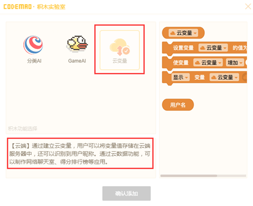

 云变量在其变量名前会有字符：“☁”，以便与常规变量区分，并且与常规变量积木之间无法混搭使用。

  #####  *由于云数据模块的特殊性，在离线编辑器或是无网络的情况下都无法使用云数据相关积木。

## 二、云变量

### 1、新建云变量

新建云变量与新建常规变量不同，需要在云端积木盒中找到新建云变量按钮：

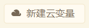

云变量的命名规则与普通变量相同，即首字符不能为数字，不能包括字母、数字、汉字以外的字符。

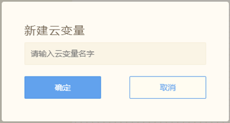

并且云变量的命名不能与已有的云变量名以及普通变量名重复。

建好的云变量会以时间顺序排列，在一个作品中，最多可以新建10个云变量。

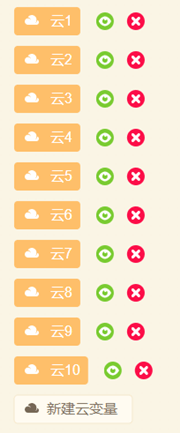

### 2、设置云变量
新建好云变量后，云端积木盒中会出现云变量相关积木，其功能与普通变量相同。

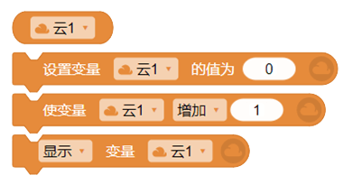

云变量即可以是数字，也可以为字符串类型。

需要注意的是，云变量的长度限制为128个字符，超过的字符，将会被忽略。

### 3、修改云变量
在创作界面中，云变量的值可以在舞台中进行修改。

比如：

   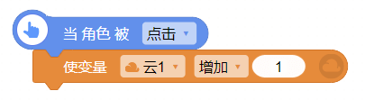

每次点击角色后，云变量“云1”的值将会增加1，并且会通过网络存储在云端服务器中。

当作品停止再运行时，云变量将会读取储存在云端服务器中的值。

同时要注意避免像普通变量这样的积木搭配：

   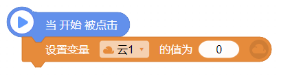

虽然我们停止程序运行时会将数据存储在云端，但是如果每次运行程序，都设置云变量为0的话，

相当于替换掉了云端储存的变量值，无法达到想要的效果。

并且云变量的相关积木都不支持调试模式（即单独点击积木预览效果），必须点击“开始”，运行程序查看效果。
 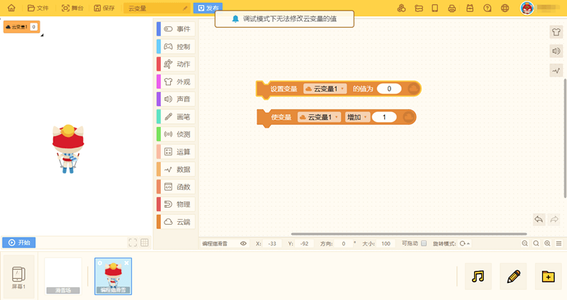

当你的云变量作品发布后，平台的所有登录用户都可以在你的作品中，读取或修改云变量的值。

### 4、未登录用户及微信用户
   未登录账号的用户打开的云变量作品，会在开始程序的那一刻读取到储存在云端中的云变量值。

   但是，在这之后，云变量就不会再反复读取云端的值，相当于一个普通变量，修改的值也不会被上传到云端。

云变量作品在微信里传播时，我们对微信用户做了特殊处理，在这一版中，微信用户是可以使用云变量功能的，在之后的版本中我们会对微信端用户进行优化。

### 5、云变量的运用
通过云变量，我们可以实现数据的储存和共享，可以制作很多特别的作品。
下面用三个例子来说明云变量的运用：
#### 作品1：《助力投票器》
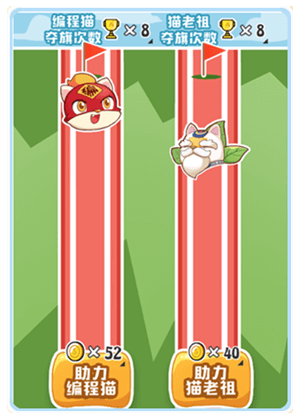

  通过简单的“点击角色增加云变量值”的积木组合，我们可以制作像投票这类的统计作品。
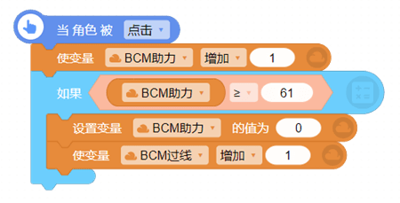

当“助力编程猫”按钮被点击时，云变量“BCM助力”增加1，也就是编程猫得到1票。

当云变量达到61时，使另一个云变量“BCM过线”增加1，也就是增加编程猫的夺旗次数。

同时将云变量“BCM助力”的数据归为0，重新计数。

“助力猫老祖”也是同样的操作哦。

这样，最后我们只要统计双方的夺旗次数+助力次数，就可以知道谁获得胜利啦！

实现了一个支持多人同时投票的程序！

#### 作品2：《编程猫新春聊天室》

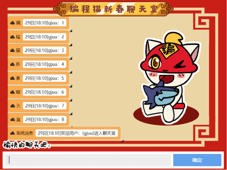

聊天室的做法，就是新建多个云变量，这些云变量的内容在所有用户看来都是同步显示。

当聊天室里某一个用户通过“询问积木”发出消息后，我们会先用一个普通变量X来存储获得答复的内容。
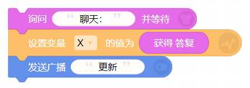

同时借助广播将所有的云变量都上移一个位置，在这里我们不改变系统消息的位置，使其一直在最后一行，显示进入的用户昵称。

将除“系统消息”外的最后一个云变量“室”设置为刚刚的获得答复的内容，即变量X。

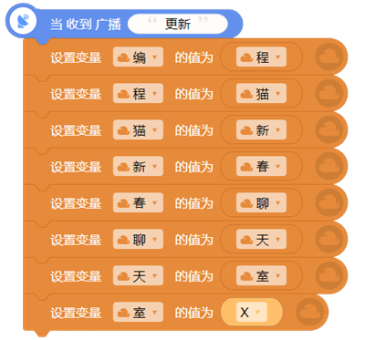

这样，每个用户发出来的最新内容都会显示在最后面，所有登录用户都可以看到实时内容哦。

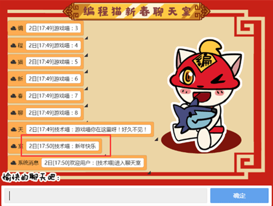
##### （如图，最新一条消息显示在除系统消息外的最下面。）

#### 作品3：《排行榜》
使用云变量还可以做出简单的排行榜：

当用户完成游戏，拥有得分后，就可以用普通变量的得分与云变量中存储的得分进行对比。

我们从第一名开始往下对比，如果你的得分高于云端存储的第一名。

我们就将排行榜中所有的云变量下移一个位置，腾出第一名的位置并将其设为你的得分。

如果得分比第一名低，就与第二名对比，比第二名低，就与第三名对比，以此类推。
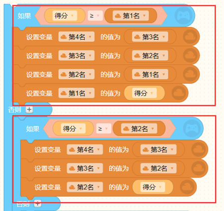

我们还可以配合用户名积木，让排行榜显示昵称+得分的效果。

## 三、用户名

用户名的显示分为以下几种：

1.平台登录用户，该用户名为平台用户的编程猫昵称。

2.平台未登录用户，如果是未登录用户使用这个块积木，会显示为：未登录用户。

3.微信用户，只要是微信端登录的用户，会显示为：微信用户。

  微信端用户会在名称后面随机加上00-99的数字作为区分。

  ##### * 需要注意的是，每次登录得到的数字都是随机的。

