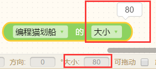

# 侦测类
## 1.鼠标\[按下/点击/放开\]

* 布尔类型积木（布尔类型积木只会返回成立或不成立两个值）
* 侦测游戏运行时鼠标是否在游戏屏幕中按下/点击/放开

* 如果鼠标左键按下，则成立。可执行语句

> 贡献者：糖醋排骨（10岁）& 假·猫老祖（9岁）

## 2.\[按下/放开\]按键\[a\]

* 布尔类型积木

* 按下指定按键时，条件成立，会继续执行后续脚本。

* 与事件类积木里的“当\[按下\]\[a\]”区别在于：积木类型不同，但功能相同，按下a键、 皆可触发条件！
  如果一直按住则会不断触发[按下]条件。

| 状态    | 按下、放开                           |
| :---- | :------------------------------ |
| 键盘key | 26个英文字母，0-9数字，上下左右键，空格键，回车键，任意键 |

> 贡献者：糖醋排骨（10岁）

## 3.\[自己\]碰到[ ？]

* 属于布尔值类型积木
* 侦测指定角色物体或阵营是否碰到其他角色物体或指定颜色阵营，执行语句

> 贡献者：糖醋排骨（10岁）

## 4.\[自己\]碰到颜色\[色块\]

* 属于布尔值类型积木
* 即时侦测游戏运行时 “选择项的角色” 是否碰到对应颜色。
* 碰到指定颜色时，条件成立

> 贡献者：糖醋排骨（10岁）& 假·猫老祖（9岁）

* **颜色值概念**：

FFFFFF-000000 十六进制FF是255 00就是0

前两位表示red红，中间表示green绿，最后两位表示blue蓝

> 贡献者：于念一（12岁）

## 5.离开\[边缘\]

* 即时侦测游戏运行时当前角色造型平面图是否全部离开边缘/上/下/左/右边缘。
* 如果角色离开整个舞台，则此积木条件成立。

> 贡献者：糖醋排骨（10岁）

## 6.\[自己\]的\[X坐标\]

* 数值类型积木，可调取角色的某个数据。
* 包括：X坐标、Y坐标、造型编号、角度、造型名字、大小、颜色、语句、透明、亮度

> 贡献者：糖醋排骨（10岁）

* #### 举个例子：调取角色“编程猫划船”的大小

## 7.到\[鼠标\]的距离

* 即时调出当前此角色到“选择项角色”的距离。
> 贡献者：假·猫老祖（9岁）

## 8.鼠标的X/Y坐标

* 即时调出鼠标目前在游戏屏幕上的X/Y坐标。
> 贡献者：假·猫老祖（9岁）

## 9.舞台宽度/高度

* 调出舞台宽度和舞台长度。竖版舞台默认宽(620)、高(900)。
> 贡献者：假·猫老祖（9岁）

## 10.当前[年]

* 即时调出现当前的[年/月/日/星期/小时/分钟/秒] 数据
* **应用场景**：可用来制做时钟
> 贡献者：假·猫老祖（9岁）& 主播喵副本(11岁)

## 11.计时器

* 即时调出计时器数值。
> 贡献者：假·猫老祖（9岁）

## 12.计时器归零

* 使游戏中运行的计时器数值清空。
> 贡献者：假·猫老祖（9岁）

## 13.\[开启/关闭\]声音侦测

* 开启/关闭 声音侦测
> 贡献者：假·猫老祖（9岁）
* **技术喵提示**：如果没有开启声音侦测是没有办法捕获“当前音量”的。
* **应用场景**：[制作《八分音符》]

## 14.当前音量

* 侦测当前声音的音量数值大小。
> 贡献者：假·猫老祖（9岁）

## 15.[离开/留在]屏幕（1）

* 属于布尔值积木类型
* 侦测游戏运行时当前角色是否离开或留在指定屏幕。
* **技术喵提示**：
  * “离开边缘”判断角色的坐标离开舞台边缘，而“离开屏幕”是在多屏幕情况下，判断当前运行的屏幕。
  * 巧妙使用“离开屏幕”积木，能够在离开当前屏幕后停止运行一些不必要的积木，在多屏幕游戏中，能极大减轻运行中不必要的消耗，使游戏运行更流畅。

> 贡献者：技术喵

## 16.手机倾斜[X/Y]分量

* 侦测手机是否倾斜，并返回倾斜数据，包括设备前后倾斜度、两侧倾斜度。
* **技术喵提示**：手机需内置陀螺仪。

| 坐标系  |                        |
| :--- | :--------------------- |
| X    | 当X为正值表示屏幕向右倾斜，负值则向左倾斜。 |
| Y    | 当Y为正值表示屏幕向上倾斜，负值则向下倾斜。 |

* **应用场景**：
  在手机游戏上，可借助手机倾斜度来控制人物的方向或动作。可应用在类似制作《神庙逃亡》，《地铁跑酷》等手机游戏中。
> 贡献者：技术喵

